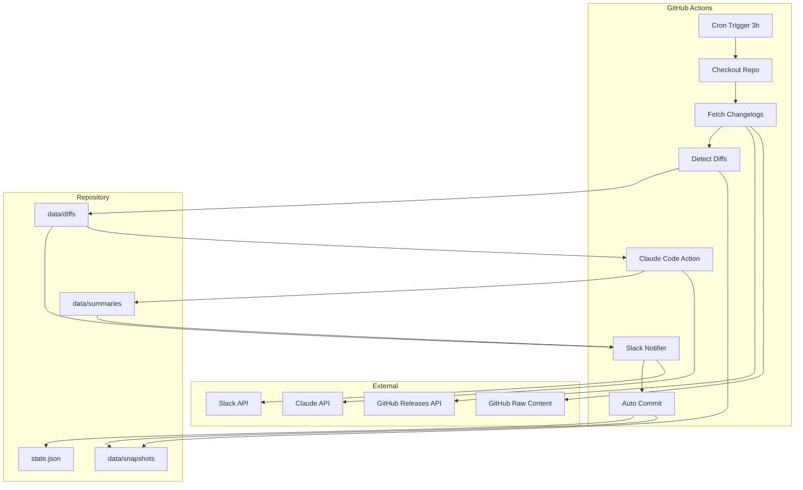
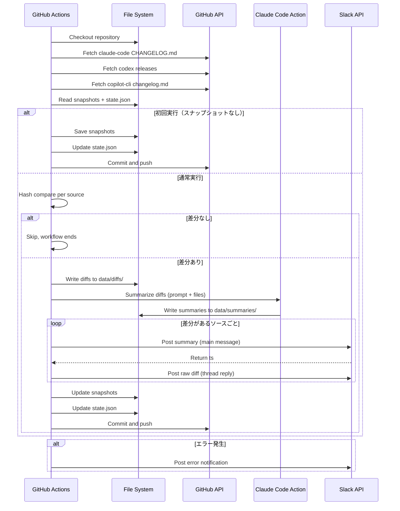
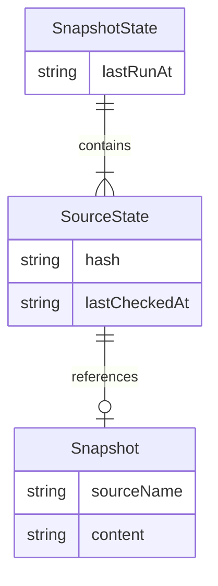

# Design Document: cc-news-bot

## Overview

**Purpose**: AI コーディングツール（Claude Code, OpenAI Codex, GitHub Copilot CLI）の changelog 更新を自動検知し、Claude Code Action による日本語要約付きで Slack に通知する。

**Users**: 開発チームメンバーが、手動チェックなしに AI ツールの最新変更を把握するために利用する。

### Goals

- 3時間ごとに 3 つの changelog を自動監視し、差分を検出する
- Claude Code Action で差分を日本語要約（ひとこと / 変更内容 / 用語解説）する
- Slack にソースごとの要約メッセージ + スレッド返信で原文を投稿する

### Non-Goals

- 監視対象の動的追加・削除（現時点では 3 ソース固定）
- Slack 以外の通知チャンネル（Email, Teams 等）
- changelog の翻訳機能（要約のみ）
- CI/CD パイプラインとの連携

## Architecture

### Architecture Pattern & Boundary Map



**Architecture Integration**:

- Selected pattern: 単一ジョブ順次実行パイプライン。シンプルで状態共有が容易
- Concurrency control: `concurrency: { group: changelog-notifier, cancel-in-progress: false }` により、cron と workflow_dispatch の並行実行を防止。先行ジョブの完了を待機する
- Domain boundaries: Fetch / Diff / Summarize / Notify の 4 ステップに責務分離
- New components rationale: 全て新規。TypeScript スクリプトで各ステップを実装

### Technology Stack

| Layer        | Choice / Version           | Role in Feature             | Notes                                                                   |
| ------------ | -------------------------- | --------------------------- | ----------------------------------------------------------------------- |
| Runtime      | Node.js 24+ / tsx          | TypeScript スクリプトの実行 | package.json で node >= 24 を指定済み                                   |
| Language     | TypeScript 5.x             | 型安全なスクリプト実装      | tsx で直接実行（ビルド不要）                                            |
| CI/CD        | GitHub Actions             | cron スケジュール実行       | `0 */3 * * *`、`concurrency` グループで並行実行防止                     |
| AI           | Claude Code Action v1      | 差分の日本語要約生成        | OAuth トークン認証、Automation Mode（`prompt` input + `allowed_tools`） |
| Notification | Slack Web API              | メッセージ投稿              | chat.postMessage                                                        |
| Data         | ファイルシステム (JSON/MD) | スナップショット・状態管理  | リポジトリ内に永続化                                                    |

## System Flows

### メイン実行フロー



## Requirements Traceability

| Requirement | Summary                                 | Components                 | Interfaces    | Flows        |
| ----------- | --------------------------------------- | -------------------------- | ------------- | ------------ |
| 1.1         | cron 3時間ごと実行                      | Workflow                   | -             | メインフロー |
| 1.2         | workflow_dispatch 対応                  | Workflow                   | -             | メインフロー |
| 1.3         | 3ソース全取得                           | FetchService               | FetchResult   | メインフロー |
| 2.1         | claude-code 取得                        | FetchService               | FetchResult   | メインフロー |
| 2.2         | codex releases 取得                     | FetchService               | FetchResult   | メインフロー |
| 2.3         | copilot-cli 取得                        | FetchService               | FetchResult   | メインフロー |
| 2.4         | 取得失敗時エラー通知                    | FetchService, SlackService | -             | エラーフロー |
| 3.1         | スナップショット保持                    | StateService               | SnapshotState | -            |
| 3.2         | 差分検出                                | DiffService                | DiffResult    | メインフロー |
| 3.3         | 差分なし時スキップ                      | DiffService                | -             | メインフロー |
| 3.4         | 差分ありで後続処理                      | DiffService                | DiffResult    | メインフロー |
| 3.5         | ソース独立の差分検出                    | DiffService                | -             | メインフロー |
| 4.1         | 初回はスナップショット保存のみ          | StateService               | -             | 初回フロー   |
| 4.2         | 初回は通知なし                          | Workflow                   | -             | 初回フロー   |
| 4.3         | 初回コミット                            | Workflow                   | -             | 初回フロー   |
| 5.1         | Claude で要約生成                       | Claude Code Action         | prompt        | メインフロー |
| 5.2         | OAuth トークン認証                      | Workflow                   | -             | -            |
| 5.3         | 要約フォーマット遵守                    | Claude Code Action         | prompt        | メインフロー |
| 5.4         | ソースごと個別要約                      | Claude Code Action         | -             | メインフロー |
| 6.1         | 要約を Slack 投稿                       | SlackService               | PostResult    | メインフロー |
| 6.2         | スレッド返信で原文                      | SlackService               | PostResult    | メインフロー |
| 6.3         | ソースごと別メッセージ                  | SlackService               | -             | メインフロー |
| 6.4         | 長文分割                                | SlackService               | -             | メインフロー |
| 6.5         | 投稿失敗ログ                            | SlackService               | -             | エラーフロー |
| 7.1         | 取得失敗を Slack 通知                   | SlackService               | -             | エラーフロー |
| 7.2         | エラー時他ソース継続                    | Workflow                   | -             | エラーフロー |
| 7.3         | エラー通知にソース名含む                | SlackService               | -             | エラーフロー |
| 8.1         | スナップショット更新                    | StateService               | -             | メインフロー |
| 8.2         | 自動コミット                            | Workflow                   | -             | メインフロー |
| 8.3         | 最終チェック日時記録                    | StateService               | SnapshotState | -            |
| 8.4         | 差分なし時コミットしない                | Workflow                   | -             | メインフロー |
| 9.1         | SLACK_BOT_TOKEN を Secrets 参照         | Workflow                   | -             | -            |
| 9.2         | CLAUDE_CODE_OAUTH_TOKEN を Secrets 参照 | Workflow                   | -             | -            |
| 9.3         | ハードコード禁止                        | Workflow                   | -             | -            |

## Components and Interfaces

| Component          | Domain/Layer     | Intent                                                  | Req Coverage                             | Key Dependencies  | Contracts      |
| ------------------ | ---------------- | ------------------------------------------------------- | ---------------------------------------- | ----------------- | -------------- |
| Workflow           | Infrastructure   | GitHub Actions ワークフロー定義（concurrency 制御含む） | 1.1-1.3, 4.2-4.3, 5.2, 8.2, 8.4, 9.1-9.3 | All components    | -              |
| FetchService       | Data Acquisition | 3ソースからの changelog 取得                            | 2.1-2.4                                  | GitHub API (P0)   | Service        |
| DiffService        | Processing       | スナップショットとの差分検出                            | 3.1-3.5                                  | StateService (P0) | Service        |
| StateService       | Persistence      | スナップショットと状態の永続化                          | 3.1, 4.1, 8.1, 8.3                       | File System (P0)  | Service, State |
| SlackService       | Notification     | Slack メッセージ投稿                                    | 6.1-6.5, 7.1-7.3                         | Slack API (P0)    | Service        |
| Claude Code Action | AI/Summarization | 差分の日本語要約生成                                    | 5.1-5.4                                  | Claude API (P0)   | Batch          |

### Data Acquisition Layer

#### FetchService

| Field        | Detail                                                 |
| ------------ | ------------------------------------------------------ |
| Intent       | 3つの監視対象から最新の changelog コンテンツを取得する |
| Requirements | 2.1, 2.2, 2.3, 2.4                                     |

**Responsibilities & Constraints**

- 各ソースの changelog を HTTP 経由で取得
- openai/codex は GitHub Releases API を使用し body を Markdown として抽出
- 取得失敗時は該当ソースのエラーを返し、他ソースは処理継続

**Dependencies**

- External: GitHub Raw Content API — claude-code, copilot-cli の Markdown 取得 (P0)
- External: GitHub Releases API — openai/codex のリリース情報取得 (P0)

**Contracts**: Service [x]

##### Service Interface

```typescript
interface SourceConfig {
  name: string;
  type: "raw_markdown" | "github_releases";
  url: string;
  owner?: string;
  repo?: string;
}

interface FetchResult {
  source: string;
  success: boolean;
  content?: string; // Markdown テキスト
  error?: string;
}

interface FetchService {
  fetchAll(sources: SourceConfig[]): Promise<FetchResult[]>;
  fetchRawMarkdown(url: string): Promise<string>;
  fetchGitHubReleases(owner: string, repo: string, token?: string): Promise<string>;
}
```

- Preconditions: ネットワーク接続が有効
- Postconditions: 各ソースの FetchResult が返却される（成功・失敗いずれか）
- Invariants: 1つのソースの失敗が他ソースに影響しない

**Implementation Notes**

- openai/codex の Releases は `per_page=10` で最新 10 件を取得し、各リリースを `## {tag_name} ({published_at})\n{body}` の形式で連結する。リリースは `published_at` 降順（最新が先頭）とする
- GitHub Releases API はレート制限あり（認証なし 60 req/hour）。ワークフローで `GITHUB_TOKEN` を環境変数として明示的に渡し、認証済みリクエスト（5,000 req/hour）を使用する
- HTTP タイムアウトは 30 秒に設定

### Processing Layer

#### DiffService

| Field        | Detail                                                      |
| ------------ | ----------------------------------------------------------- |
| Intent       | 前回スナップショットと最新 changelog を比較し差分を検出する |
| Requirements | 3.1, 3.2, 3.3, 3.4, 3.5                                     |

**Responsibilities & Constraints**

- SHA-256 ハッシュで変更有無を高速判定
- 変更がある場合のみテキスト diff を生成
- 各ソースを独立して処理

**Dependencies**

- Inbound: FetchService — 最新の changelog コンテンツ (P0)
- Inbound: StateService — 前回のスナップショット (P0)

**Contracts**: Service [x]

##### Service Interface

```typescript
interface DiffResult {
  source: string;
  hasChanges: boolean;
  oldHash: string;
  newHash: string;
  diffText?: string; // テキスト diff（変更がある場合のみ）
  newContent: string; // 最新の完全なコンテンツ
}

interface DiffService {
  detectChanges(
    source: string,
    currentContent: string,
    previousSnapshot: string | null,
  ): DiffResult;
}
```

- Preconditions: currentContent が空でない
- Postconditions: hasChanges が true の場合、diffText が設定される
- Invariants: 同一コンテンツに対して同一ハッシュを返す

**Implementation Notes**

- `previousSnapshot` が null の場合（初回実行）、`hasChanges: false` を返しスナップショット保存のみ
- diff アルゴリズムは行単位の unified diff 形式

### Persistence Layer

#### StateService

| Field        | Detail                                             |
| ------------ | -------------------------------------------------- |
| Intent       | changelog スナップショットと状態メタデータの永続化 |
| Requirements | 3.1, 4.1, 8.1, 8.3                                 |

**Responsibilities & Constraints**

- スナップショットファイル（Markdown）の読み書き
- state.json によるメタデータ（ハッシュ、最終チェック日時）の管理
- ファイルが存在しない場合（初回）は null を返す

**Dependencies**

- External: File System — リポジトリ内ファイル読み書き (P0)

**Contracts**: Service [x] / State [x]

##### Service Interface

```typescript
interface StateService {
  loadSnapshot(source: string): Promise<string | null>;
  saveSnapshot(source: string, content: string): Promise<void>;
  loadState(): Promise<SnapshotState>;
  saveState(state: SnapshotState): Promise<void>;
}
```

##### State Management

```typescript
interface SourceState {
  hash: string;
  lastCheckedAt: string; // ISO 8601
}

interface SnapshotState {
  lastRunAt: string; // ISO 8601
  sources: Record<string, SourceState>;
}
```

- Persistence: `data/snapshots/{source-name}.md` + `state.json`
- Concurrency: ワークフローレベルで `concurrency` グループにより並行実行を防止済み。単一ジョブ内では順次実行のため競合なし

### Notification Layer

#### SlackService

| Field        | Detail                                       |
| ------------ | -------------------------------------------- |
| Intent       | Slack への要約投稿、スレッド返信、エラー通知 |
| Requirements | 6.1, 6.2, 6.3, 6.4, 6.5, 7.1, 7.2, 7.3       |

**Responsibilities & Constraints**

- chat.postMessage で要約をメインメッセージとして投稿
- 返却された ts を使ってスレッド返信で原文 diff を投稿
- 4,000 文字超の原文は固定文字数で分割して複数スレッド返信
- エラー通知はソース名とエラー内容を含む
- 投稿間に 1 秒のウェイトを挿入（レート制限対策）

**Dependencies**

- External: Slack Web API (chat.postMessage) — メッセージ投稿 (P0)

**Contracts**: Service [x]

##### Service Interface

```typescript
interface PostResult {
  success: boolean;
  ts?: string; // メッセージの timestamp（スレッド返信用）
  error?: string;
}

interface SlackService {
  postSummary(channel: string, source: string, summary: string): Promise<PostResult>;
  postThreadReply(channel: string, threadTs: string, text: string): Promise<PostResult>;
  postError(channel: string, source: string, error: string): Promise<PostResult>;
}
```

- Preconditions: SLACK_BOT_TOKEN が有効
- Postconditions: 投稿成功時に ts が返却される
- Invariants: 投稿間隔が 1 秒以上

**Implementation Notes**

- 分割の閾値は 3,500 文字（Slack の 4,000 文字上限に余裕を持たせる）
- mrkdwn フォーマットはデフォルト有効
- 投稿失敗時はワークフローログにエラーを記録し、処理を継続

### AI/Summarization Layer

#### Claude Code Action

| Field        | Detail                                                             |
| ------------ | ------------------------------------------------------------------ |
| Intent       | 差分テキストを日本語で要約し、指定フォーマットでファイルに書き出す |
| Requirements | 5.1, 5.2, 5.3, 5.4                                                 |

**Responsibilities & Constraints**

- `data/diffs/` 内のファイルを読み取り、ソースごとに要約を生成
- 要約を `data/summaries/{source-name}.md` に書き出し
- 指定フォーマット（ひとこと / 変更内容 / 用語解説）を厳守

**Dependencies**

- External: Claude API — 要約生成 (P0)
- Inbound: data/diffs/ — 差分テキスト (P0)

**Contracts**: Batch [x]

##### Batch / Job Contract

- Trigger: ワークフロー内の step として実行（差分がある場合のみ）
- Input: `data/diffs/` ディレクトリ内の Markdown ファイル
- Output: `data/summaries/` ディレクトリ内の Markdown ファイル（ソースごと）
- Idempotency: 同一 diff に対して再実行可能（上書き）

##### 動作メカニズム

Claude Code Action (`anthropics/claude-code-action@v1`) は `schedule` / `workflow_dispatch` トリガーで **Automation Mode** として動作する。PR/Issue コンテキストは不要。

**ワークフロー step 構成**:

```yaml
- uses: anthropics/claude-code-action@v1
  with:
    claude_code_oauth_token: ${{ secrets.CLAUDE_CODE_OAUTH_TOKEN }}
    prompt: |
      data/diffs/ ディレクトリ内の各 Markdown ファイルを読み取り、
      それぞれのソースについて以下のフォーマットで日本語要約を生成してください。

      ## フォーマット
      ## ひとこと
      - 差分の中で目玉機能などをピックアップし、わかりやすくひとことで

      ## 変更内容
      ### 新規追加
      - xxx
      ### 修正
      - xxx
      ### 改善
      - xxx

      ## 用語解説
      - 特殊な用語があればピックアップして解説

      各ソースの要約を data/summaries/{source-name}.md に書き出してください。
    allowed_tools: "Read,Write,Edit,Glob"
    claude_args: "--max-turns 15"
```

**Key Points**:

- `prompt` input でカスタムプロンプトを直接指定（`direct_prompt` は deprecated）
- `allowed_tools` でファイル読み書きツールを明示的に許可
- `--max-turns` で Claude の実行ターン数を制限（複数ファイル処理のため余裕を持たせる）
- Claude はリポジトリ内のファイルに直接アクセスし、`Write` ツールで summaries を書き出す
- `contents: read` 権限で十分（コミットは後続の step で TypeScript スクリプトが実行）

## Data Models

### Domain Model



### Physical Data Model

**ファイル構造**:

```
data/
├── snapshots/          # 前回の changelog 生テキスト
│   ├── claude-code.md
│   ├── codex.md
│   └── copilot-cli.md
├── diffs/              # 今回検出された差分（一時ファイル）
│   ├── claude-code.md
│   ├── codex.md
│   └── copilot-cli.md
├── summaries/          # Claude が生成した要約（一時ファイル）
│   ├── claude-code.md
│   ├── codex.md
│   └── copilot-cli.md
└── current/            # 今回取得した changelog（一時ファイル）
    ├── claude-code.md
    ├── codex.md
    └── copilot-cli.md
state.json              # メタデータ
```

**state.json の構造**:

```json
{
  "lastRunAt": "2026-02-28T12:00:00Z",
  "sources": {
    "claude-code": {
      "hash": "sha256-abc123...",
      "lastCheckedAt": "2026-02-28T12:00:00Z"
    },
    "codex": {
      "hash": "sha256-def456...",
      "lastCheckedAt": "2026-02-28T12:00:00Z"
    },
    "copilot-cli": {
      "hash": "sha256-ghi789...",
      "lastCheckedAt": "2026-02-28T12:00:00Z"
    }
  }
}
```

## Error Handling

### Error Strategy

- Fail Graceful: 1 ソースのエラーが全体を止めない
- Notify: エラーは Slack に通知
- Log: 全エラーをワークフローログに記録

### Error Categories and Responses

| Category         | Trigger                            | Response                                     | Req          |
| ---------------- | ---------------------------------- | -------------------------------------------- | ------------ |
| 取得エラー       | HTTP タイムアウト、404、レート制限 | Slack にエラー通知、該当ソースをスキップ     | 2.4, 7.1-7.3 |
| Claude エラー    | API エラー、トークン無効           | Slack にエラー通知、ワークフローログに記録   | 5.1          |
| Slack 投稿エラー | チャンネル不正、トークン無効       | ワークフローログに記録                       | 6.5          |
| コミットエラー   | 権限不足、コンフリクト             | ワークフローログに記録（次回実行で自動回復） | 8.2          |

## Testing Strategy

### Unit Tests

- FetchService: 各ソースの HTTP レスポンスパース
- DiffService: ハッシュ比較、diff 生成、初回実行判定
- StateService: state.json の読み書き、スナップショット管理
- SlackService: メッセージ分割ロジック、API リクエスト構築

### Integration Tests

- Fetch → Diff → State の一連フロー
- Slack 投稿 + スレッド返信の連携
- 初回実行（スナップショットなし）シナリオ

### E2E Tests

- `workflow_dispatch` による手動実行で全ステップを確認
- 差分なしのケースでスキップされることを確認
- エラー注入テスト（無効な URL でエラー通知を確認）
