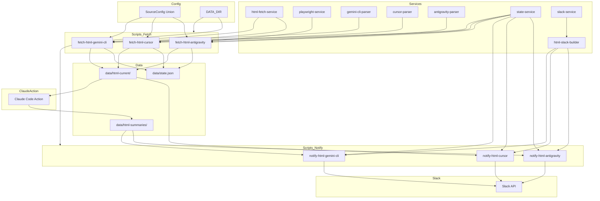
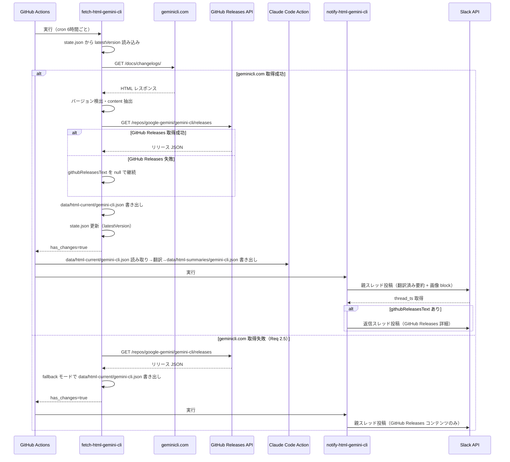
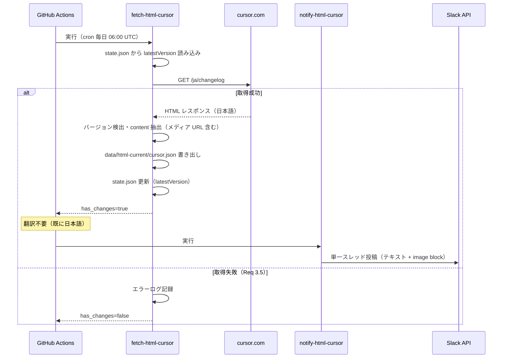
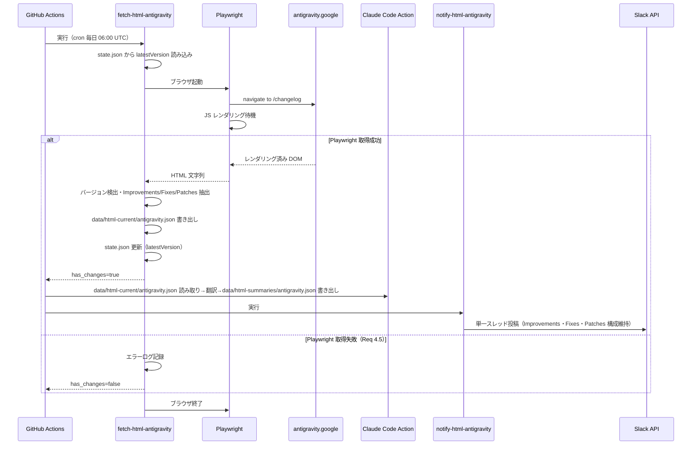

# 設計書: HTML ソースプロバイダ

---

## Overview

本機能は cc-news-bot に **Gemini CLI・Cursor・Antigravity** の3ソースを追加する。既存の `raw_markdown` / `github_releases` プロバイダと異なり、HTML スクレイピング（静的 HTML + ヘッドレスブラウザ）により更新情報を取得する。`SourceConfig.type` Union の拡張によって既存コードへの影響を最小化し、プロバイダごとに独立したスクリプトと GitHub Actions ワークフローを新設する。

翻訳処理（Gemini CLI 要約・Antigravity コンテンツの日英→日本語変換）は、既存の Claude Code Action パターンを踏襲し、`anthropics/claude-code-action@v1` を介して `data/html-current/{source}.json` を入力・`data/html-summaries/{source}.json` を出力とする3フェーズアーキテクチャで実現する。

### Goals

- HTML ページからバージョンを差分検出し新規バージョンのみ Slack に通知する共通基盤を構築する
- Gemini CLI: 翻訳済み要約を親スレッドに、GitHub Releases 詳細を返信スレッドに2段階投稿する
- Cursor: 取得コンテンツをそのまま（既に日本語）単一スレッドで投稿する
- Antigravity: ヘッドレスブラウザ取得 + 翻訳して Improvements・Fixes・Patches の構成を維持した単一スレッドを投稿する

### Non-Goals

- 既存の `raw_markdown` / `github_releases` プロバイダへの変更
- HTML プロバイダ間でのパーサロジックの共有（各プロバイダの DOM 構造が固有のため）
- 動画の直接 Slack 埋め込み（Block Kit 非対応のためサムネイル + リンクで代替）

---

## Architecture

### Existing Architecture Analysis

既存システムは以下のパターンで稼働している。

- `SourceConfig.type: "raw_markdown" | "github_releases"` の Union Type で取得方式を分岐
- `fetch-and-diff.ts`（取得・差分検出）→ Claude Code Action（日本語要約生成）→ `notify.ts`（Slack 通知）→ `git commit`（`data/state.json` + `data/snapshots/` を永続化）の3フェーズ
- `SourceState` は `hash`・`lastCheckedAt`・`latestReleasedAt?` で管理
- GitHub Actions が `data/state.json` を git commit してワークフロー間の状態を共有

HTML プロバイダは `latestVersion?: string` フィールドを `SourceState` に追加することで同一 `state.json` ファイルを共有し、既存の永続化機構を再利用する。

### Architecture Pattern & Boundary Map



**アーキテクチャ統合:**

- 採用パターン: 単一責務スクリプト + 依存性注入（既存 `*Deps` パターン踏襲）
- ドメイン境界: fetch スクリプト（取得・抽出）/ Claude Code Action（翻訳）/ notify スクリプト（Slack 通知）の3フェーズ境界
- 既存パターン維持: Union Type による取得方式分岐・`*Deps` インターフェース・ファイルベース状態管理
- 新規コンポーネント: `html-fetch-service`・`playwright-service`・各パーサ・`html-slack-builder`
- ステアリング準拠: `SourceConfig.type` による分岐パターン・副作用の引数注入・ESM-only

### Technology Stack

| レイヤー           | 採用 / バージョン                                  | フィーチャーでの役割                                | 備考                                      |
| ------------------ | -------------------------------------------------- | --------------------------------------------------- | ----------------------------------------- |
| HTML パーシング    | cheerio 最新安定版                                 | Gemini CLI・Cursor の静的 HTML 解析                 | ESM 対応・jQuery API・週間 DL 数 1,200 万 |
| ヘッドレスブラウザ | playwright 最新安定版                              | Antigravity の JS レンダリングページ取得            | GitHub Actions 公式サポートあり           |
| 翻訳               | anthropics/claude-code-action@v1                   | Gemini CLI 要約・Antigravity コンテンツの日本語翻訳 | 既存ワークフローと同一パターン            |
| HTTP クライアント  | Node.js fetch（標準）                              | Gemini CLI・Cursor の HTTP 取得                     | 既存踏襲・ライブラリ追加不要              |
| Slack 通知         | slack-service（既存） + html-slack-builder（新規） | Block Kit メッセージ生成・投稿                      | image block 型拡張が必要                  |
| 状態管理           | state-service（既存拡張）                          | latestVersion フィールド追加                        | JSON ファイル + git commit で永続化       |

調査の詳細（cheerio vs node-html-parser 比較・Playwright vs Puppeteer）は `research.md` を参照。

---

## System Flows

### Gemini CLI フロー



> フォールバック（Req 2.5）: `geminicli.com` 取得失敗時は GitHub Releases のみで通知。`githubReleasesText` 欠落時（Req 2.6）は親スレッドのみで完了。

### Cursor フロー



### Antigravity フロー



---

## Requirements Traceability

| 要件 ID | 要件概要                                                | コンポーネント                                                  | インターフェース                                           | フロー                                   |
| ------- | ------------------------------------------------------- | --------------------------------------------------------------- | ---------------------------------------------------------- | ---------------------------------------- |
| 1.1     | HTML プロバイダを拡張可能な型として追加                 | SourceConfig 拡張・html-fetch-service・playwright-service       | HtmlScrapingSourceConfig・HtmlHeadlessSourceConfig         | —                                        |
| 1.2     | 指定 URL から HTML 取得・更新情報抽出                   | html-fetch-service・playwright-service・各パーサ                | fetchStaticHtml・fetchHeadlessHtml                         | Gemini CLI / Cursor / Antigravity フロー |
| 1.3     | latestVersion を state.json に永続化・差分検出          | state-service 拡張                                              | SourceState.latestVersion                                  | 全フロー                                 |
| 1.4     | 取得失敗時にエラーログ記録・通知スキップ                | fetch-html-\* スクリプト                                        | FetchHtmlResult.error                                      | 各フロー error path                      |
| 2.1     | バージョン識別子 v0.x.x 形式                            | gemini-cli-parser                                               | parseLatestVersion                                         | Gemini CLI フロー                        |
| 2.2     | geminicli.com からコンテンツ取得                        | html-fetch-service・gemini-cli-parser                           | fetchStaticHtml・parseVersionContent                       | Gemini CLI フロー                        |
| 2.3     | 日本語翻訳・画像付き親スレッド投稿                      | Claude Code Action・notify-html-gemini-cli・html-slack-builder  | GeminiCliTranslatedContent・buildGeminiCliBlocks           | Gemini CLI フロー                        |
| 2.4     | GitHub Releases 詳細を返信スレッドに投稿                | notify-html-gemini-cli・slack-service                           | postThreadReplies                                          | Gemini CLI フロー                        |
| 2.5     | geminicli.com 失敗時 GitHub Releases フォールバック     | fetch-html-gemini-cli                                           | FetchHtmlResult.fallback                                   | Gemini CLI フロー（error path）          |
| 2.6     | GitHub Releases 失敗時は親スレッドのみで完了            | notify-html-gemini-cli                                          | GeminiCliRawContent.githubReleasesText optional            | Gemini CLI フロー                        |
| 3.1     | バージョン識別子 major.minor 形式                       | cursor-parser                                                   | parseLatestVersion                                         | Cursor フロー                            |
| 3.2     | cursor.com/ja/changelog からコンテンツ取得              | html-fetch-service・cursor-parser                               | fetchStaticHtml・parseVersionContent                       | Cursor フロー                            |
| 3.3     | 翻訳なしでそのまま単一スレッド投稿                      | notify-html-cursor・html-slack-builder                          | CursorRawContent・buildCursorBlocks                        | Cursor フロー                            |
| 3.4     | 画像・動画を通知に含める                                | html-slack-builder                                              | buildCursorBlocks（image block + Mux link）                | Cursor フロー                            |
| 3.5     | Cursor 取得失敗時は通知スキップ                         | fetch-html-cursor                                               | FetchHtmlResult.error                                      | Cursor フロー（error path）              |
| 4.1     | バージョン識別子 X.Y.Z 形式（v プレフィックスなし）     | antigravity-parser                                              | parseLatestVersion                                         | Antigravity フロー                       |
| 4.2     | ヘッドレスブラウザで取得                                | playwright-service                                              | fetchHeadlessHtml                                          | Antigravity フロー                       |
| 4.3     | Improvements・Fixes・Patches の3カテゴリ抽出            | antigravity-parser                                              | parseVersionContent                                        | Antigravity フロー                       |
| 4.4     | 日本語翻訳・カテゴリ構成維持で単一スレッド投稿          | Claude Code Action・notify-html-antigravity・html-slack-builder | AntigravityTranslatedContent・buildAntigravityBlocks       | Antigravity フロー                       |
| 4.5     | Playwright 失敗時は通知スキップ                         | fetch-html-antigravity                                          | FetchHtmlResult.error                                      | Antigravity フロー（error path）         |
| 5.1     | 全 HTML プロバイダを Block Kit 形式で投稿               | html-slack-builder                                              | SlackBlock（拡張）                                         | 全フロー                                 |
| 5.2     | ソース名・バージョン・更新内容を含める                  | html-slack-builder                                              | build\*Blocks の引数                                       | 全フロー                                 |
| 5.3     | 画像・GIF を image block に含める（Gemini CLI・Cursor） | html-slack-builder                                              | ImageBlock.image_url                                       | Gemini CLI・Cursor フロー                |
| 5.4     | Cursor・Antigravity は全コンテンツを単一スレッドに集約  | notify-html-cursor・notify-html-antigravity                     | 単一 postBlocks 呼び出し                                   | Cursor・Antigravity フロー               |
| 6.1     | エラー内容・ソース・タイムスタンプをログ記録            | fetch-html-\* スクリプト                                        | console.error + structured log                             | 全エラーパス                             |
| 6.2     | geminicli.com 不可時 GitHub Releases フォールバック     | fetch-html-gemini-cli                                           | GeminiCliRawContent.mode: "fallback"                       | Gemini CLI フロー                        |
| 7.1     | プロバイダごとに独立した workflow ファイル              | 3つの GitHub Actions workflow                                   | —                                                          | —                                        |
| 7.2     | cron スケジュールをプロバイダごとに個別設定             | 各 workflow の schedule                                         | Gemini CLI: `0 */6 * * *`・Cursor/Antigravity: `0 6 * * *` | —                                        |
| 7.3     | workflow_dispatch トリガーで手動実行可能                | 各 workflow                                                     | —                                                          | —                                        |

---

## Components and Interfaces

### コンポーネントサマリー

| コンポーネント           | レイヤー | 目的                                       | 要件カバレッジ                    | 主要依存                                                            | コントラクト    |
| ------------------------ | -------- | ------------------------------------------ | --------------------------------- | ------------------------------------------------------------------- | --------------- |
| SourceConfig 拡張        | Config   | HTML プロバイダ型追加                      | 1.1                               | —                                                                   | 型定義          |
| SourceState 拡張         | Config   | latestVersion フィールド追加               | 1.3                               | —                                                                   | 型定義          |
| html-fetch-service       | Service  | 静的 HTML 取得                             | 1.2, 2.2, 3.2                     | Node.js fetch, cheerio                                              | Service         |
| playwright-service       | Service  | ヘッドレスブラウザ HTML 取得               | 4.2                               | playwright                                                          | Service         |
| gemini-cli-parser        | Service  | Gemini CLI HTML 解析                       | 2.1, 2.2                          | cheerio                                                             | Service         |
| cursor-parser            | Service  | Cursor HTML 解析                           | 3.1, 3.2                          | cheerio                                                             | Service         |
| antigravity-parser       | Service  | Antigravity DOM 解析                       | 4.1, 4.3                          | cheerio                                                             | Service         |
| slack-service 拡張       | Service  | `ImageBlock` 型追加・`postBlocks` 関数追加 | 5.1, 5.3                          | —                                                                   | 型定義・Service |
| html-slack-builder       | Service  | HTML プロバイダ用 Block Kit 生成           | 5.1, 5.2, 5.3, 5.4                | slack-service（拡張）                                               | Service         |
| fetch-html-gemini-cli    | Script   | Gemini CLI 取得・抽出スクリプト            | 1.2, 1.4, 2.1, 2.2, 2.5, 6.1, 6.2 | html-fetch-service, gemini-cli-parser, fetch-service, state-service | Batch           |
| fetch-html-cursor        | Script   | Cursor 取得・抽出スクリプト                | 1.2, 1.4, 3.1, 3.2, 3.5, 6.1      | html-fetch-service, cursor-parser, state-service                    | Batch           |
| fetch-html-antigravity   | Script   | Antigravity 取得・抽出スクリプト           | 1.2, 1.4, 4.1, 4.2, 4.3, 4.5, 6.1 | playwright-service, antigravity-parser, state-service               | Batch           |
| notify-html-gemini-cli   | Script   | Gemini CLI Slack 通知スクリプト            | 2.3, 2.4, 2.6, 5.1, 5.2, 5.3      | html-slack-builder, slack-service, state-service                    | Batch           |
| notify-html-cursor       | Script   | Cursor Slack 通知スクリプト                | 3.3, 3.4, 5.1, 5.2, 5.3, 5.4      | html-slack-builder, slack-service                                   | Batch           |
| notify-html-antigravity  | Script   | Antigravity Slack 通知スクリプト           | 4.4, 5.1, 5.2, 5.4                | html-slack-builder, slack-service                                   | Batch           |
| GitHub Actions Workflows | Infra    | CI/CD スケジュール実行                     | 7.1, 7.2, 7.3                     | —                                                                   | —               |

---

### Config レイヤー

#### SourceConfig 拡張（src/config/sources.ts）

| フィールド | 詳細                                                                |
| ---------- | ------------------------------------------------------------------- |
| 目的       | `"html_scraping" \| "html_headless"` 型を SourceConfig Union に追加 |
| 要件       | 1.1                                                                 |

**責務と制約**

- 既存の `"raw_markdown" \| "github_releases"` 型を変更しない
- `HtmlScrapingSourceConfig` / `HtmlHeadlessSourceConfig` は共通フィールド（`name`, `url`, `botName`, `botEmoji`）のみを持つ

**コントラクト: 型定義**

```typescript
export interface HtmlScrapingSourceConfig {
  readonly name: string;
  readonly type: "html_scraping";
  readonly url: string;
  readonly botName: string;
  readonly botEmoji: string;
}

export interface HtmlHeadlessSourceConfig {
  readonly name: string;
  readonly type: "html_headless";
  readonly url: string;
  readonly botName: string;
  readonly botEmoji: string;
}

// 既存 Union に追加:
export type SourceConfig =
  | RawMarkdownSourceConfig
  | GitHubReleasesSourceConfig
  | HtmlScrapingSourceConfig
  | HtmlHeadlessSourceConfig;
```

また `DATA_DIR` に以下を追加する:

```typescript
export const DATA_DIR = {
  // ... 既存フィールド
  htmlCurrent: resolve(DATA_ROOT, "html-current"),
  htmlSummaries: resolve(DATA_ROOT, "html-summaries"),
} as const;
```

`ensureDataDirs`（`config/init-dirs.ts`）の `SUBDIRS` に `"html-current"` と `"html-summaries"` を追加する。

#### SourceState 拡張（src/services/state-service.ts）

| フィールド | 詳細                                                  |
| ---------- | ----------------------------------------------------- |
| 目的       | HTML プロバイダのバージョン差分検出用フィールドを追加 |
| 要件       | 1.3                                                   |

**コントラクト: 型定義**

```typescript
export interface SourceState {
  hash: string;
  lastCheckedAt: string; // ISO 8601
  latestReleasedAt?: string; // github_releases 用（既存）
  latestVersion?: string; // html_scraping / html_headless 用（新規）
}
```

- 事前条件: `latestVersion` が `undefined` の場合は初回実行とみなし、バージョンを記録するのみで通知しない
- 事後条件: 新バージョン検出後に `latestVersion` を新バージョン文字列に更新する
- 不変条件: 既存の `hash` / `latestReleasedAt` フィールドの意味に変更なし

---

### Services レイヤー

#### html-fetch-service（src/services/html-fetch-service.ts）

| フィールド | 詳細                                                             |
| ---------- | ---------------------------------------------------------------- |
| 目的       | Node.js fetch を使用して静的 HTML ページを取得し文字列として返す |
| 要件       | 1.2, 2.2, 3.2                                                    |

**責務と制約**

- HTML 文字列の返却のみに責務を限定（パーシングは各パーサが担当）
- タイムアウト制御（`AbortSignal.timeout`）は既存 `fetch-service.ts` と同一パターン
- User-Agent ヘッダーを設定してボットブロックを回避する

**依存関係**

- 外部: Node.js 標準 fetch API — HTTP 取得（P0）

**コントラクト: Service**

```typescript
export interface HtmlFetchOptions {
  readonly timeoutMs?: number;
  readonly userAgent?: string;
}

export async function fetchStaticHtml(url: string, options?: HtmlFetchOptions): Promise<string>;
// エラー時は Error をスロー（呼び出し元がキャッチして FetchHtmlResult.error に変換）
```

- 事前条件: `url` は有効な HTTPS URL
- 事後条件: HTTP 200 の場合 HTML 文字列を返す
- エラー: HTTP 非 200 または タイムアウト時は `Error` をスロー

#### playwright-service（src/services/playwright-service.ts）

| フィールド | 詳細                                                               |
| ---------- | ------------------------------------------------------------------ |
| 目的       | Playwright Chromium を使用して JS レンダリング後の HTML を取得する |
| 要件       | 4.2                                                                |

**責務と制約**

- ブラウザの起動・ナビゲート・HTML 取得・終了のライフサイクルを管理する
- `networkidle` 待機でレンダリング完了を確認する
- 現在 Antigravity は単一 URL のみのため、毎回起動・終了で十分（将来複数 URL が必要になった場合に再設計する）

**依存関係**

- 外部: playwright (Chromium) — ヘッドレスブラウザ（P0）

**コントラクト: Service**

```typescript
export interface PlaywrightFetchOptions {
  readonly timeoutMs?: number;
  readonly waitUntil?: "load" | "networkidle";
}

export async function fetchHeadlessHtml(
  url: string,
  options?: PlaywrightFetchOptions,
): Promise<string>;
// エラー時は Error をスロー
```

- 事前条件: Playwright Chromium がインストール済み
- 事後条件: JS レンダリング後の完全な HTML 文字列を返す

#### gemini-cli-parser（src/services/gemini-cli-parser.ts）

| フィールド | 詳細                                                               |
| ---------- | ------------------------------------------------------------------ |
| 目的       | Gemini CLI changelog HTML からバージョンと要約コンテンツを抽出する |
| 要件       | 2.1, 2.2                                                           |

**責務と制約**

- `<h2 id="announcements-v0310---2026-02-27">` パターンからバージョンを抽出する
- バージョン形式: `v0.x.x`（`vN.N.N` の正規表現でマッチ）
- 画像 URL: `` および `` パターンから抽出

**依存関係**

- 外部: cheerio — HTML パーシング（P0）

**コントラクト: Service**

```typescript
export interface GeminiCliVersionContent {
  readonly version: string; // "v0.31.0"
  readonly rawSummaryEn: string; // 英語の要約テキスト（Markdown 形式）
  readonly imageUrls: readonly string[];
}

export function parseLatestVersion(html: string): string | null;
// 最新バージョン文字列（"v0.31.0"）、見つからない場合は null

export function parseVersionContent(html: string, version: string): GeminiCliVersionContent | null;
// 指定バージョンのコンテンツ、見つからない場合は null
```

#### cursor-parser（src/services/cursor-parser.ts）

| フィールド | 詳細                                                       |
| ---------- | ---------------------------------------------------------- |
| 目的       | Cursor changelog HTML からバージョンとコンテンツを抽出する |
| 要件       | 3.1, 3.2, 3.4                                              |

**責務と制約**

- `<article>` 要素内の `<time dateTime>` 属性と heading からバージョン（`major.minor` 形式）を抽出
- 動画: Mux の `playbackId` を抽出し、サムネイル URL と HLS URL を生成する

**依存関係**

- 外部: cheerio — HTML パーシング（P0）

**コントラクト: Service**

```typescript
export interface MuxVideo {
  readonly playbackId: string;
  readonly thumbnailUrl: string; // "https://image.mux.com/{id}/thumbnail.png"
  readonly hlsUrl: string; // "https://stream.mux.com/{id}.m3u8"
}

export interface CursorVersionContent {
  readonly version: string; // "2.5"
  readonly contentJa: string; // 日本語テキスト（Markdown 形式）
  readonly imageUrls: readonly string[];
  readonly videos: readonly MuxVideo[];
}

export function parseLatestVersion(html: string): string | null;
export function parseVersionContent(html: string, version: string): CursorVersionContent | null;
```

#### antigravity-parser（src/services/antigravity-parser.ts）

| フィールド | 詳細                                                                                          |
| ---------- | --------------------------------------------------------------------------------------------- |
| 目的       | Antigravity changelog の Playwright レンダリング済み HTML からバージョンと3カテゴリを抽出する |
| 要件       | 4.1, 4.3                                                                                      |

**責務と制約**

- バージョン形式: `X.Y.Z`（`v` プレフィックスなし）
- 固定3カテゴリ: `Improvements`・`Fixes`・`Patches` のセクション見出しでパーシング
- 空カテゴリは空配列で返す（`null` は使用しない）

**依存関係**

- 外部: cheerio — HTML パーシング（P0）

**コントラクト: Service**

```typescript
export interface AntigravityVersionContent {
  readonly version: string; // "1.19.6"
  readonly improvementsEn: readonly string[];
  readonly fixesEn: readonly string[];
  readonly patchesEn: readonly string[];
}

export function parseLatestVersion(html: string): string | null;
export function parseVersionContent(
  html: string,
  version: string,
): AntigravityVersionContent | null;
```

#### html-slack-builder（src/services/html-slack-builder.ts）

| フィールド | 詳細                                                       |
| ---------- | ---------------------------------------------------------- |
| 目的       | HTML プロバイダ向けの Slack Block Kit メッセージを生成する |
| 要件       | 5.1, 5.2, 5.3, 5.4                                         |

**責務と制約**

- `SlackBlock` 型に `image` ブロック型を追加する（`slack-service.ts` の型定義を拡張）
- image block の `image_url` は公開 HTTPS URL のみ（`imgur.com` / Mux サムネイル URL）
- 動画はサムネイル image block + HLS URL テキストリンクで表現する（Slack は動画埋め込み非対応）
- Mux 動画がある場合: `` 形式のサムネイル image block + テキスト section で HLS リンクを付記

**依存関係**

- 内部: slack-service（既存）— `SlackBlock` 型・`MAX_BLOCK_TEXT_LENGTH` 定数（P0）

**コントラクト: Service**

```typescript
// slack-service.ts に追加（1）: SlackBlock Union を拡張
export type ImageBlock = {
  readonly type: "image";
  readonly image_url: string;
  readonly alt_text: string;
  readonly title?: { readonly type: "plain_text"; readonly text: string };
};

// SlackBlock = ... | ImageBlock

// slack-service.ts に追加（2）: 事前ビルド済み blocks を受け取る汎用投稿関数
export async function postBlocks(
  channel: string,
  blocks: SlackBlock[],
  text: string,
  token: string,
  botProfile?: BotProfile,
): Promise<PostResult>;

// html-slack-builder.ts
export interface GeminiCliTranslatedContent {
  readonly version: string;
  readonly summaryJa: string;
  readonly imageUrls: readonly string[];
  readonly githubReleasesText?: string;
}

export interface AntigravityTranslatedContent {
  readonly version: string;
  readonly improvementsJa: readonly string[];
  readonly fixesJa: readonly string[];
  readonly patchesJa: readonly string[];
}

export function buildGeminiCliBlocks(content: GeminiCliTranslatedContent): SlackBlock[];
// 翻訳済み要約テキスト + image blocks を組み合わせた親スレッド用メッセージ

export function buildCursorBlocks(content: CursorVersionContent): SlackBlock[];
// 日本語コンテンツ + image blocks + Mux サムネイル/リンクを含む単一スレッド用メッセージ

export function buildAntigravityBlocks(content: AntigravityTranslatedContent): SlackBlock[];
// Improvements / Fixes / Patches の3セクション構成の単一スレッド用メッセージ
```

- 事前条件: 各 content 引数は `null` でないことを保証（呼び出し元で null ガード済み）

---

### Scripts レイヤー

#### fetch-html-gemini-cli（src/scripts/fetch-html-gemini-cli.ts）

| フィールド | 詳細                                                                                                |
| ---------- | --------------------------------------------------------------------------------------------------- |
| 目的       | Gemini CLI changelog を取得・解析し、新バージョン検出時にコンテンツを data/html-current/ に書き出す |
| 要件       | 1.2, 1.4, 2.1, 2.2, 2.5, 6.1, 6.2                                                                   |

**コントラクト: Batch**

- トリガー: GitHub Actions ワークフロー（cron `0 */6 * * *`）または手動実行
- 入力: `data/state.json`・環境変数 `GITHUB_TOKEN`
- 出力: `data/html-current/gemini-cli.json`（新バージョン検出時）・`data/state.json`（更新）・`GITHUB_OUTPUT: has_changes=true/false`
- 冪等性: 同一バージョンを再検出した場合 `has_changes=false` を出力してファイル書き出しをスキップする

**依存性注入インターフェース:**

```typescript
export interface FetchHtmlGeminiCliDeps {
  readonly dataRoot: string;
  readonly htmlCurrentDir: string;
  readonly fetchStaticHtml: (url: string, opts?: HtmlFetchOptions) => Promise<string>;
  readonly fetchGitHubReleases: (owner: string, repo: string, token?: string) => Promise<string>;
  readonly parseLatestVersion: (html: string) => string | null;
  readonly parseVersionContent: (html: string, version: string) => GeminiCliVersionContent | null;
  readonly loadState: (root: string) => Promise<SnapshotState>;
  readonly saveState: (state: SnapshotState, root: string) => Promise<void>;
}

export interface FetchHtmlGeminiCliResult {
  readonly hasChanges: boolean;
  readonly newVersion?: string;
  readonly mode?: "full" | "fallback";
  readonly error?: string;
}

export async function fetchHtmlGeminiCli(
  deps: FetchHtmlGeminiCliDeps,
): Promise<FetchHtmlGeminiCliResult>;
```

#### fetch-html-cursor（src/scripts/fetch-html-cursor.ts）

| フィールド | 詳細                                                                                            |
| ---------- | ----------------------------------------------------------------------------------------------- |
| 目的       | Cursor changelog を取得・解析し、新バージョン検出時にコンテンツを data/html-current/ に書き出す |
| 要件       | 1.2, 1.4, 3.1, 3.2, 3.5, 6.1                                                                    |

**依存性注入インターフェース:**

```typescript
export interface FetchHtmlCursorDeps {
  readonly dataRoot: string;
  readonly htmlCurrentDir: string;
  readonly fetchStaticHtml: (url: string, opts?: HtmlFetchOptions) => Promise<string>;
  readonly parseLatestVersion: (html: string) => string | null;
  readonly parseVersionContent: (html: string, version: string) => CursorVersionContent | null;
  readonly loadState: (root: string) => Promise<SnapshotState>;
  readonly saveState: (state: SnapshotState, root: string) => Promise<void>;
}

export interface FetchHtmlCursorResult {
  readonly hasChanges: boolean;
  readonly newVersion?: string;
  readonly error?: string;
}

export async function fetchHtmlCursor(deps: FetchHtmlCursorDeps): Promise<FetchHtmlCursorResult>;
```

#### fetch-html-antigravity（src/scripts/fetch-html-antigravity.ts）

| フィールド | 詳細                                                                                                               |
| ---------- | ------------------------------------------------------------------------------------------------------------------ |
| 目的       | Playwright で Antigravity changelog を取得・解析し、新バージョン検出時にコンテンツを data/html-current/ に書き出す |
| 要件       | 1.2, 1.4, 4.1, 4.2, 4.3, 4.5, 6.1                                                                                  |

**依存性注入インターフェース:**

```typescript
export interface FetchHtmlAntigravityDeps {
  readonly dataRoot: string;
  readonly htmlCurrentDir: string;
  readonly fetchHeadlessHtml: (url: string, opts?: PlaywrightFetchOptions) => Promise<string>;
  readonly parseLatestVersion: (html: string) => string | null;
  readonly parseVersionContent: (html: string, version: string) => AntigravityVersionContent | null;
  readonly loadState: (root: string) => Promise<SnapshotState>;
  readonly saveState: (state: SnapshotState, root: string) => Promise<void>;
}

export interface FetchHtmlAntigravityResult {
  readonly hasChanges: boolean;
  readonly newVersion?: string;
  readonly error?: string;
}

export async function fetchHtmlAntigravity(
  deps: FetchHtmlAntigravityDeps,
): Promise<FetchHtmlAntigravityResult>;
```

#### notify-html-gemini-cli / notify-html-cursor / notify-html-antigravity

各 notify スクリプトは同一パターンに従う。`data/html-summaries/{source}.json`（Cursor は `data/html-current/cursor.json`）を読み取り、対応する Block Kit ビルダーを呼び出して Slack に投稿する。

```typescript
// 例: notify-html-gemini-cli.ts
export interface NotifyHtmlGeminiCliDeps {
  readonly htmlSummariesDir: string; // Cursor は htmlCurrentDir
  readonly getChannels: (source: string) => string[];
  readonly slackToken: string;
  readonly buildBlocks: (content: GeminiCliTranslatedContent) => SlackBlock[];
  readonly postBlocks: (
    channel: string,
    blocks: SlackBlock[],
    text: string,
    token: string,
    botProfile?: BotProfile,
  ) => Promise<PostResult>;
  readonly postThreadReplies: (
    channel: string,
    threadTs: string,
    text: string,
    token: string,
    options?: PostOptions,
  ) => Promise<PostResult[]>;
}

export async function notifyHtmlGeminiCli(deps: NotifyHtmlGeminiCliDeps): Promise<void>;
```

---

## Data Models

### Domain Model

- **HTML ソースプロバイダ**: `SourceConfig` のサブタイプ。バージョン文字列を差分検出の識別子として保持する。
- **抽出済みコンテンツ**: プロバイダごとに異なるスキーマ（`GeminiCliVersionContent`・`CursorVersionContent`・`AntigravityVersionContent`）を持つ。
- **翻訳済みコンテンツ**: Claude Code Action が生成。`GeminiCliTranslatedContent`・`AntigravityTranslatedContent` として `data/html-summaries/` に保存。

### Logical Data Model

#### data/html-current/gemini-cli.json

```typescript
interface GeminiCliCurrentFile {
  version: string; // "v0.31.0"
  rawSummaryEn: string; // 英語要約テキスト（Markdown 形式）
  imageUrls: string[]; // imgur.com 等の公開 URL
  githubReleasesText: string | null; // GitHub Releases の Markdown テキスト、取得失敗時は null
  mode: "full" | "fallback"; // "fallback" は geminicli.com 取得失敗時
  fetchedAt: string; // ISO 8601
}
```

#### data/html-summaries/gemini-cli.json（Claude Code Action 生成）

```typescript
interface GeminiCliSummariesFile {
  version: string;
  summaryJa: string; // 翻訳済み日本語要約
  imageUrls: string[];
  githubReleasesText: string | null;
}
```

#### data/html-current/cursor.json

```typescript
interface CursorCurrentFile {
  version: string; // "2.5"
  contentJa: string; // 日本語テキスト（Markdown 形式）
  imageUrls: string[];
  videos: Array<{
    playbackId: string;
    thumbnailUrl: string;
    hlsUrl: string;
  }>;
  fetchedAt: string;
}
```

#### data/html-current/antigravity.json

```typescript
interface AntigravityCurrentFile {
  version: string; // "1.19.6"
  improvementsEn: string[];
  fixesEn: string[];
  patchesEn: string[];
  fetchedAt: string;
}
```

#### data/html-summaries/antigravity.json（Claude Code Action 生成）

```typescript
interface AntigravitySummariesFile {
  version: string;
  improvementsJa: string[];
  fixesJa: string[];
  patchesJa: string[];
}
```

### 状態永続化

`data/state.json` の `sources` フィールドに各 HTML プロバイダのエントリが追加される。`html-current/` と `html-summaries/` はワークフロー内の一時ファイルであり git commit 対象外（`.gitignore` 対象）。

```json
{
  "lastRunAt": "2026-03-02T06:00:00.000Z",
  "sources": {
    "gemini-cli": {
      "hash": "",
      "lastCheckedAt": "2026-03-02T06:00:00.000Z",
      "latestVersion": "v0.31.0"
    },
    "cursor": {
      "hash": "",
      "lastCheckedAt": "2026-03-02T06:00:00.000Z",
      "latestVersion": "2.5"
    },
    "antigravity": {
      "hash": "",
      "lastCheckedAt": "2026-03-02T06:00:00.000Z",
      "latestVersion": "1.19.6"
    }
  }
}
```

---

## Error Handling

### エラー戦略

グレースフルデグラデーションを原則とする。個別プロバイダの失敗は他プロバイダの動作に影響しない。ワークフローレベルでは各プロバイダが独立したワークフローファイルを持つため、障害が分離される。

### エラー分類と対応

| エラー種別                                   | 発生箇所                  | 対応                                                                                      |
| -------------------------------------------- | ------------------------- | ----------------------------------------------------------------------------------------- |
| HTTP 取得失敗（非 200 / タイムアウト）       | html-fetch-service        | Error をスロー → fetch-html スクリプトがキャッチ → `has_changes=false` 出力・エラーログ   |
| Playwright 起動 / ナビゲート失敗             | playwright-service        | Error をスロー → fetch-html-antigravity がキャッチ → `has_changes=false` 出力・エラーログ |
| バージョン抽出失敗（DOM 構造変更等）         | 各パーサ                  | `null` を返す → fetch-html スクリプトが通知スキップ・エラーログ                           |
| Gemini CLI プライマリソース失敗              | fetch-html-gemini-cli     | フォールバック: GitHub Releases のみで継続（Req 2.5）                                     |
| GitHub Releases 取得失敗（フォールバック中） | fetch-html-gemini-cli     | エラーログ → `has_changes=false` 出力（通知不可）                                         |
| GitHub Releases 取得失敗（フル取得時）       | fetch-html-gemini-cli     | `githubReleasesText: null` として継続、親スレッドのみ通知（Req 2.6）                      |
| Slack 投稿失敗                               | notify-html-\* スクリプト | エラーログ記録、state.json を更新しない（次回再通知）                                     |

### ログ形式

```typescript
// エラーログの構造化出力（stderr に console.error）
console.error(
  JSON.stringify({
    level: "error",
    source: "gemini-cli",
    message: error.message,
    timestamp: new Date().toISOString(),
  }),
);
```

---

## Testing Strategy

### ユニットテスト（src/\_\_tests\_\_/）

- `html-fetch-service.test.ts`: msw でモック HTTP サーバを立て、200・非 200・タイムアウトの各ケースをテスト
- `playwright-service.test.ts`: playwright の `chromium.launch` をモックし、HTML 返却・エラーケースをテスト
- `gemini-cli-parser.test.ts`: フィクスチャ HTML を入力とし、バージョン抽出・コンテンツ抽出・異常系（DOM 構造不正）をテスト
- `cursor-parser.test.ts`: 同様のパターン（Mux playbackId 抽出を含む）
- `antigravity-parser.test.ts`: 3カテゴリの抽出・空カテゴリケース・バージョン抽出をテスト
- `html-slack-builder.test.ts`: 各 build\*Blocks 関数の出力を検証（image block の image_url・alt_text 等）

### 統合テスト

- `fetch-html-gemini-cli.test.ts`: `FetchHtmlGeminiCliDeps` をフルモック化し、フルモード・フォールバックモード・エラーケース・初回実行（通知スキップ）をテスト
- `fetch-html-cursor.test.ts`: 同パターン
- `fetch-html-antigravity.test.ts`: 同パターン

### E2E テスト（省略）

実際の外部 URL へのアクセスを伴うため、CI では実行しない。手動確認を要する変更時のみローカルで実行する。

---

## Security Considerations

- `SLACK_CHANNEL_ID_GEMINI_CLI`・`SLACK_CHANNEL_ID_CURSOR`・`SLACK_CHANNEL_ID_ANTIGRAVITY` を GitHub Actions Secrets に追加する
- `CLAUDE_CODE_OAUTH_TOKEN`・`GITHUB_TOKEN` は既存 Secrets を再利用
- Playwright の `--no-sandbox` フラグは GitHub Actions の Linux 環境で必要（設定済みの公式推奨構成を使用）
- 取得した HTML コンテンツを Slack に投稿する前に、スクリプトインジェクション相当の問題は発生しない（HTML タグは cheerio でテキスト抽出済みの plain text / Markdown を投稿するため）

---

## Performance & Scalability

- Gemini CLI: 6時間ごとの実行。fetch-service（Gemini CLI HTML + GitHub Releases API）の合計タイムアウトは 30 秒
- Cursor: 毎日1回。静的 HTML 取得のみで Playwright 不使用のため実行時間は短い
- Antigravity: 毎日1回。Playwright 起動（約 10〜30 秒）が支配的。GitHub Actions の `ubuntu-latest` 上では `playwright install --with-deps chromium` が必要

---

## GitHub Actions Workflow 設計

各ワークフローは以下の共通構造を持つ:

```yaml
# .github/workflows/html-notify-gemini-cli.yml
name: HTML Notify - Gemini CLI
on:
  schedule:
    - cron: "0 */6 * * *"
  workflow_dispatch:
concurrency:
  group: html-notify-gemini-cli
  cancel-in-progress: false
jobs:
  notify:
    runs-on: ubuntu-latest
    permissions:
      contents: write
      id-token: write
    steps:
      - uses: actions/checkout@v4
      - uses: actions/setup-node@v4
        with:
          node-version: 24
      - name: Install dependencies
        run: corepack enable && pnpm install --frozen-lockfile
      - name: Fetch Gemini CLI changelog
        id: fetch
        run: npx tsx src/scripts/fetch-html-gemini-cli.ts
        env:
          GITHUB_TOKEN: ${{ secrets.GITHUB_TOKEN }}
      - name: Translate with Claude
        if: steps.fetch.outputs.has_changes == 'true'
        uses: anthropics/claude-code-action@v1
        with:
          claude_code_oauth_token: ${{ secrets.CLAUDE_CODE_OAUTH_TOKEN }}
          prompt: |
            data/html-current/gemini-cli.json を読み取り、rawSummaryEn フィールドを
            日本語に翻訳し、summaryJa フィールドとして
            data/html-summaries/gemini-cli.json に書き出してください。
            imageUrls と githubReleasesText フィールドはそのままコピーしてください。
          claude_args: "--max-turns 20 --allowedTools Read,Write"
      - name: Post to Slack
        if: steps.fetch.outputs.has_changes == 'true'
        run: npx tsx src/scripts/notify-html-gemini-cli.ts
        env:
          SLACK_BOT_TOKEN: ${{ secrets.SLACK_BOT_TOKEN }}
          SLACK_CHANNEL_ID_GEMINI_CLI: ${{ secrets.SLACK_CHANNEL_ID_GEMINI_CLI }}
      - name: Commit state
        if: steps.fetch.outputs.has_changes == 'true'
        run: |
          git config user.name "github-actions[bot]"
          git config user.email "github-actions[bot]@users.noreply.github.com"
          git add data/state.json
          git diff --cached --quiet || git commit -m "chore: update html source state"
          git remote set-url origin https://x-access-token:${{ secrets.GITHUB_TOKEN }}@github.com/${{ github.repository }}.git
          git push
```

Cursor ワークフロー（`html-notify-cursor.yml`）:

- cron: `0 6 * * *`
- Claude Code Action ステップを省略（翻訳不要）

Antigravity ワークフロー（`html-notify-antigravity.yml`）:

- cron: `0 6 * * *`
- Playwright インストールステップを追加: `run: npx playwright install --with-deps chromium`

---

## Supporting References

詳細な調査ログ（Playwright vs Puppeteer の比較・HTML パーサライブラリ選定の根拠・Slack Block Kit image block の詳細仕様）は `research.md` を参照。
