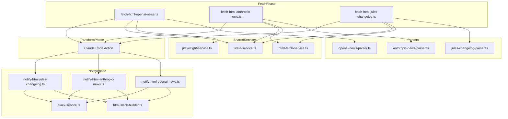
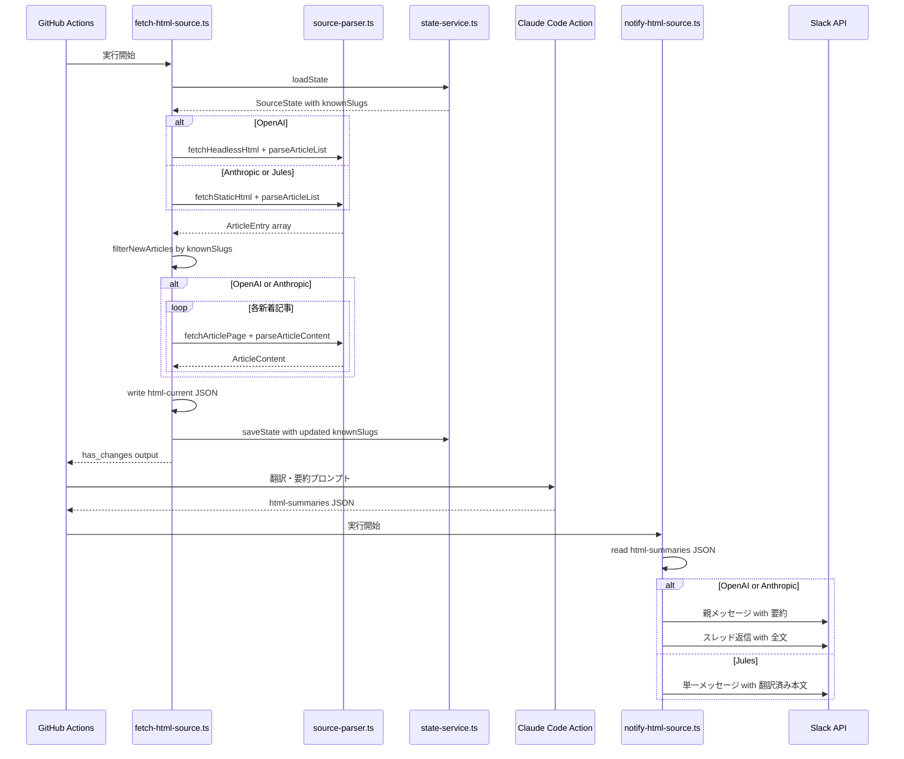
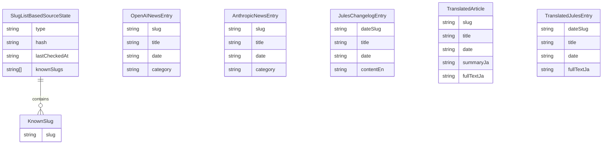

# 技術設計書: news-page-providers

## Overview

**Purpose**: OpenAI News・Anthropic News・Jules Changelog の3つのニュースページ型 HTML ソースプロバイダを cc-news-bot に追加し、記事単位の差分検出と日本語 Slack 通知を実現する。

**Users**: ボット管理者がプロバイダを設定し、チームメンバーが Slack で新着記事を日本語で受け取る。

**Impact**: 既存の 3-Phase Pipeline（fetch → transform → notify）アーキテクチャに3つの新ソースを追加。`SourceState` を slug リストベースの差分検出に拡張する。

### Goals

- 既存 HTML ソースプロバイダと一貫したアーキテクチャで3ソースを追加する
- slug リストベースの差分検出により、複数記事の同時新着を正確に追跡する
- Claude Code Action による条件付き翻訳（英語→日本語 / 日本語はそのまま）を統一的に適用する

### Non-Goals

- 汎用ニュースページプロバイダフレームワークの構築（各ソース個別実装）
- ページネーション対応（初期表示分の記事のみ対象）
- 画像・動画コンテンツの通知

## Architecture

### Existing Architecture Analysis

既存の HTML ソースプロバイダ（Antigravity・Gemini CLI・Cursor）は以下のパターンに従う:

- **3-Phase Pipeline**: `fetch-html-{source}.ts` → Claude Code Action → `notify-html-{source}.ts`
- **Deps interface**: 全副作用を関数引数で注入しテスト可能に
- **状態管理**: `data/state/{source}.json` に `SourceState` を個別保存
- **差分検出**: `latestVersion`（単一文字列）または `latestDate`+`latestSlug` で追跡

ニュースページプロバイダでは、複数記事の同時新着に対応するため `knownSlugs` リストベースの差分検出を導入する。

### Architecture Pattern & Boundary Map



**Architecture Integration**:

- **Selected pattern**: 既存 3-Phase Pipeline の踏襲 + slug リスト拡張
- **Domain boundaries**: ソースごとにパーサー・fetch スクリプト・notify スクリプトを独立
- **Existing patterns preserved**: Deps interface、状態ファイル分離、Block Kit ビルダー
- **New components rationale**: 各ソースの HTML 構造が異なるためパーサーは個別実装が必要
- **Steering compliance**: サービス分離型、副作用注入、ESM、strict TypeScript

### Technology Stack

| Layer                    | Choice / Version        | Role in Feature                    | Notes                                                       |
| ------------------------ | ----------------------- | ---------------------------------- | ----------------------------------------------------------- |
| Backend / Services       | TypeScript + Node.js 24 | パーサー・スクリプト実装           | 既存スタック踏襲                                            |
| Data / Storage           | JSON ファイル           | 中間データ・状態永続化             | `data/` ディレクトリ                                        |
| HTML パース              | cheerio                 | HTML 解析・記事抽出                | 既存依存、追加不要                                          |
| HTTP 取得（Static）      | Node.js fetch           | Anthropic・Jules の静的 HTML 取得  | `html-fetch-service.ts` 経由                                |
| HTTP 取得（Headless）    | Playwright              | OpenAI News の Cloudflare 保護回避 | `playwright-service.ts` 経由、既存 Antigravity パターン踏襲 |
| Infrastructure / Runtime | GitHub Actions          | CI/CD ワークフロー                 | 6時間ごと cron                                              |

## System Flows

### 記事取得・差分検出フロー



**Key Decisions**:

- 新着記事判定は `knownSlugs` との差集合で行う
- 初回実行時は最新3件を通知対象とし、全 slug を `knownSlugs` に登録
- OpenAI/Anthropic は個別記事ページから本文を取得、Jules は一覧ページのコンテンツをそのまま使用

## Requirements Traceability

| Requirement | Summary                                  | Components                                                | Interfaces               | Flows            |
| ----------- | ---------------------------------------- | --------------------------------------------------------- | ------------------------ | ---------------- |
| 1.1         | 3ソースの並列サポート                    | 各パーサー、各 fetch スクリプト                           | —                        | 取得フロー       |
| 1.2         | 記事一覧抽出・新着特定                   | 各パーサー `parseArticleList`                             | `ArticleEntry`           | 差分検出フロー   |
| 1.3         | slug リスト状態永続化                    | state-service.ts                                          | `SourceState.knownSlugs` | 状態保存フロー   |
| 1.4         | 初回実行時の最新3件通知                  | 各 fetch スクリプト                                       | —                        | 差分検出フロー   |
| 1.5         | 取得失敗時のスキップ                     | 各 fetch スクリプト                                       | `FetchResult.error`      | エラーフロー     |
| 2.1         | OpenAI 記事一覧抽出                      | openai-news-parser.ts                                     | `OpenAINewsEntry`        | —                |
| 2.2         | OpenAI 個別記事取得                      | openai-news-parser.ts                                     | `parseArticleContent`    | —                |
| 2.3         | OpenAI slug 差分検出                     | fetch-html-openai-news.ts                                 | `SourceState.knownSlugs` | —                |
| 2.4         | OpenAI html-current 書き出し             | fetch-html-openai-news.ts                                 | —                        | —                |
| 2.5         | OpenAI 個別記事取得失敗時スキップ        | fetch-html-openai-news.ts                                 | —                        | エラーフロー     |
| 3.1         | Anthropic 記事一覧抽出                   | anthropic-news-parser.ts                                  | `AnthropicNewsEntry`     | —                |
| 3.2         | Anthropic 個別記事取得                   | anthropic-news-parser.ts                                  | `parseArticleContent`    | —                |
| 3.3         | Anthropic slug 差分検出                  | fetch-html-anthropic-news.ts                              | `SourceState.knownSlugs` | —                |
| 3.4         | Anthropic html-current 書き出し          | fetch-html-anthropic-news.ts                              | —                        | —                |
| 3.5         | Anthropic 個別記事取得失敗時スキップ     | fetch-html-anthropic-news.ts                              | —                        | エラーフロー     |
| 4.1         | Jules article 要素から抽出               | jules-changelog-parser.ts                                 | `JulesChangelogEntry`    | —                |
| 4.2         | Jules 個別ページアクセス不要             | jules-changelog-parser.ts                                 | —                        | —                |
| 4.3         | Jules 日付ベース識別子                   | fetch-html-jules-changelog.ts                             | `SourceState.knownSlugs` | —                |
| 4.4         | Jules html-current 書き出し              | fetch-html-jules-changelog.ts                             | —                        | —                |
| 4.5         | Jules 取得失敗時スキップ                 | fetch-html-jules-changelog.ts                             | —                        | エラーフロー     |
| 5.1         | 全ソースに翻訳パイプライン適用           | Claude Code Action prompts                                | —                        | Transform フロー |
| 5.2         | 英語→日本語翻訳                          | Claude Code Action                                        | —                        | —                |
| 5.3         | 日本語コンテンツそのまま保持             | Claude Code Action                                        | —                        | —                |
| 5.4         | OpenAI/Anthropic: summaryJa + fullTextJa | Claude Code Action                                        | `TranslatedArticle`      | —                |
| 5.5         | Jules: fullTextJa のみ                   | Claude Code Action                                        | `TranslatedJulesEntry`   | —                |
| 5.6         | html-summaries 書き出し                  | Claude Code Action                                        | —                        | —                |
| 5.7         | 条件付き翻訳プロンプト                   | Claude Code Action prompts                                | —                        | —                |
| 6.1         | 記事ごとに独立メッセージ                 | 各 notify スクリプト                                      | —                        | 通知フロー       |
| 6.2         | OpenAI/Anthropic: 要約+スレッド全文      | notify-html-openai-news.ts, notify-html-anthropic-news.ts | —                        | 通知フロー       |
| 6.3         | Jules: 親メッセージのみ                  | notify-html-jules-changelog.ts                            | —                        | 通知フロー       |
| 6.4         | 画像を含めない                           | 各 notify スクリプト、SlackBuilder                        | —                        | —                |
| 6.5         | 複数記事は個別メッセージ                 | 各 notify スクリプト                                      | —                        | 通知フロー       |
| 7.1         | エラーログ記録                           | 各 fetch スクリプト                                       | —                        | エラーフロー     |
| 7.2         | 一覧取得失敗時のソーススキップ           | 各 fetch スクリプト                                       | `has_changes=false`      | エラーフロー     |
| 7.3         | 個別記事取得失敗時の記事スキップ         | fetch-html-openai-news.ts, fetch-html-anthropic-news.ts   | —                        | エラーフロー     |
| 8.1         | 独立ワークフローファイル                 | 3つの .yml ファイル                                       | —                        | —                |
| 8.2         | 6時間ごと cron                           | 各ワークフロー                                            | —                        | —                |
| 8.3         | workflow_dispatch                        | 各ワークフロー                                            | —                        | —                |
| 8.4         | 個別 Slack チャンネル ID                 | 各ワークフロー env                                        | —                        | —                |

## Components and Interfaces

| Component                      | Domain/Layer    | Intent                                            | Req Coverage            | Key Dependencies                                                         | Contracts      |
| ------------------------------ | --------------- | ------------------------------------------------- | ----------------------- | ------------------------------------------------------------------------ | -------------- |
| openai-news-parser.ts          | Services/Parser | OpenAI News HTML の記事一覧・本文抽出             | 2.1, 2.2, 2.3           | cheerio (P0)                                                             | Service        |
| anthropic-news-parser.ts       | Services/Parser | Anthropic News HTML の記事一覧・本文抽出          | 3.1, 3.2, 3.3           | cheerio (P0)                                                             | Service        |
| jules-changelog-parser.ts      | Services/Parser | Jules Changelog HTML の記事抽出                   | 4.1, 4.2, 4.3           | cheerio (P0)                                                             | Service        |
| fetch-html-openai-news.ts      | Scripts/Fetch   | OpenAI News の取得・差分検出・状態更新            | 1.1-1.5, 2.1-2.5        | openai-news-parser (P0), playwright-service (P0), state-service (P0)     | Service, State |
| fetch-html-anthropic-news.ts   | Scripts/Fetch   | Anthropic News の取得・差分検出・状態更新         | 1.1-1.5, 3.1-3.5        | anthropic-news-parser (P0), html-fetch-service (P0), state-service (P0)  | Service, State |
| fetch-html-jules-changelog.ts  | Scripts/Fetch   | Jules Changelog の取得・差分検出・状態更新        | 1.1-1.5, 4.1-4.5        | jules-changelog-parser (P0), html-fetch-service (P0), state-service (P0) | Service, State |
| notify-html-openai-news.ts     | Scripts/Notify  | OpenAI News の Slack 通知（要約+スレッド全文）    | 5.4, 6.1, 6.2, 6.4, 6.5 | html-slack-builder (P0), slack-service (P0)                              | Service        |
| notify-html-anthropic-news.ts  | Scripts/Notify  | Anthropic News の Slack 通知（要約+スレッド全文） | 5.4, 6.1, 6.2, 6.4, 6.5 | html-slack-builder (P0), slack-service (P0)                              | Service        |
| notify-html-jules-changelog.ts | Scripts/Notify  | Jules Changelog の Slack 通知（単一メッセージ）   | 5.5, 6.1, 6.3, 6.4, 6.5 | html-slack-builder (P0), slack-service (P0)                              | Service        |
| html-slack-builder.ts 拡張     | Services/Slack  | 3ソース用 Block Kit ビルダー追加                  | 6.1-6.5                 | —                                                                        | Service        |
| Claude Code Action prompts     | CI/Transform    | 翻訳・要約プロンプト定義                          | 5.1-5.7                 | —                                                                        | Batch          |
| GitHub Actions workflows       | CI/CD           | 3ソースの独立ワークフロー                         | 8.1-8.4                 | —                                                                        | Batch          |

### Services/Parser

#### openai-news-parser.ts

| Field        | Detail                                                           |
| ------------ | ---------------------------------------------------------------- |
| Intent       | OpenAI News の一覧ページ・個別記事ページから記事データを抽出する |
| Requirements | 2.1, 2.2, 2.3                                                    |

**Responsibilities & Constraints**

- 一覧ページ HTML から記事エントリ（タイトル・日付・slug）を抽出する
- 個別記事ページ HTML から本文コンテンツを Markdown 形式で抽出する
- ja-JP ページを対象とするため、タイトル・コンテンツは日本語で返される

**Dependencies**

- External: cheerio — HTML パース (P0)

**Contracts**: Service [x]

##### Service Interface

```typescript
interface OpenAINewsEntry {
  readonly slug: string;
  readonly title: string;
  readonly date: string; // ISO 8601
  readonly category: string;
}

interface OpenAINewsArticleContent {
  readonly slug: string;
  readonly title: string;
  readonly date: string;
  readonly contentJa: string; // ja-JP ページのため日本語
}

function parseArticleList(html: string): OpenAINewsEntry[];
function parseArticleContent(html: string, slug: string): string | null;
```

- Preconditions: 有効な HTML 文字列
- Postconditions: 日付降順でソートされたエントリ配列を返す。パース失敗時は空配列
- Invariants: slug は一意

**Implementation Notes**

- セレクタ: `main a[href*="/index/"]` で記事リンクを取得
- 日付: `time[datetime]` 属性から ISO 8601 文字列を抽出
- slug: `href` から `/ja-JP/index/{slug}/` パターンで抽出
- モバイル/デスクトップ DOM 重複に対して `href` でデデュプ処理

#### anthropic-news-parser.ts

| Field        | Detail                                                              |
| ------------ | ------------------------------------------------------------------- |
| Intent       | Anthropic News の一覧ページ・個別記事ページから記事データを抽出する |
| Requirements | 3.1, 3.2, 3.3                                                       |

**Responsibilities & Constraints**

- 一覧ページ HTML から記事エントリ（タイトル・日付・カテゴリ・slug）を抽出する
- 個別記事ページ HTML から本文コンテンツを抽出する
- CSS クラスハッシュに依存しない構造セレクタを使用する

**Dependencies**

- External: cheerio — HTML パース (P0)

**Contracts**: Service [x]

##### Service Interface

```typescript
interface AnthropicNewsEntry {
  readonly slug: string;
  readonly title: string;
  readonly date: string; // ISO 8601
  readonly category: string;
}

interface AnthropicNewsArticleContent {
  readonly slug: string;
  readonly title: string;
  readonly date: string;
  readonly category: string;
  readonly contentEn: string;
}

function parseArticleList(html: string): AnthropicNewsEntry[];
function parseArticleContent(html: string, slug: string): string | null;
```

- Preconditions: 有効な HTML 文字列
- Postconditions: 日付降順でソートされたエントリ配列を返す
- Invariants: slug は一意

**Implementation Notes**

- セレクタ: `a[href^="/news/"]` で記事リンクを取得（ハッシュ付きクラス名に依存しない）
- 日付: `time` 要素のテキストをパース（"Mar 6, 2026" 形式、`datetime` 属性なし）→ ISO 8601 に変換
- slug: `href` から `/news/{slug}` パターンで抽出

#### jules-changelog-parser.ts

| Field        | Detail                                                                             |
| ------------ | ---------------------------------------------------------------------------------- |
| Intent       | Jules Changelog の一覧ページから記事データ（タイトル・日付・コンテンツ）を抽出する |
| Requirements | 4.1, 4.2, 4.3                                                                      |

**Responsibilities & Constraints**

- `<article>` 要素から全エントリを抽出する
- 個別ページアクセスは不要（一覧ページに全コンテンツ展開済み）
- ページが提供する URL パス（例: `2026-02-19`, `2026-01-26-1`, `2025-12-101`）をそのまま識別子として使用する

**Dependencies**

- External: cheerio — HTML パース (P0)

**Contracts**: Service [x]

##### Service Interface

```typescript
interface JulesChangelogEntry {
  readonly dateSlug: string; // ページ URL パスから取得（例: "2026-02-19", "2026-01-26-1"）
  readonly title: string;
  readonly date: string; // ISO 8601
  readonly contentEn: string; // HTML→Markdown 変換済み
}

function parseArticleList(html: string): JulesChangelogEntry[];
```

- Preconditions: 有効な HTML 文字列
- Postconditions: 日付降順でソートされたエントリ配列を返す
- Invariants: dateSlug は一意（ページ URL パスをそのまま使用するため、同日複数エントリも一意性が保証される）

**Implementation Notes**

- セレクタ: `article.changelog-entry` で各エントリを取得
- タイトル: `article > header > h2` のテキスト
- dateSlug: 各 `<article>` の `id` 属性またはアンカーリンクの `href` から URL パスを抽出（例: `2026-02-19`, `2026-01-26-1`）
- 日付: `article > header > span.date` のテキストをパース → ISO 8601 に変換
- コンテンツ: `<header>` 以降の `<article>` 内全要素を Markdown に変換

### Scripts/Fetch

#### fetch-html-openai-news.ts

| Field        | Detail                                                                |
| ------------ | --------------------------------------------------------------------- |
| Intent       | OpenAI News を取得し、差分検出・html-current 書き出し・状態更新を行う |
| Requirements | 1.1-1.5, 2.1-2.5                                                      |

**Responsibilities & Constraints**

- 一覧ページ取得 → 記事一覧パース → knownSlugs と比較 → 新着記事の個別ページ取得
- 初回実行時は最新3件を通知対象とする
- 個別記事取得失敗時は該当記事をスキップし他を継続

**Dependencies**

- Inbound: GitHub Actions CI — トリガー (P0)
- Outbound: state-service.ts — 状態読み書き (P0)
- Outbound: playwright-service.ts — Headless HTML 取得 (P0)（Cloudflare Bot 保護回避）
- Outbound: openai-news-parser.ts — HTML パース (P0)

**Contracts**: Service [x] / State [x]

##### Service Interface

```typescript
interface FetchHtmlOpenAINewsDeps {
  readonly dataRoot: string;
  readonly htmlCurrentDir: string;
  readonly fetchHeadlessHtml: (url: string, opts?: PlaywrightFetchOptions) => Promise<string>;
  readonly parseArticleList: (html: string) => OpenAINewsEntry[];
  readonly parseArticleContent: (html: string, slug: string) => string | null;
  readonly loadState: (root: string) => Promise<SnapshotState>;
  readonly saveState: (state: SnapshotState, root: string) => Promise<void>;
}

interface FetchHtmlOpenAINewsResult {
  readonly hasChanges: boolean;
  readonly newArticles?: string[]; // slug リスト
  readonly error?: string;
}

function fetchHtmlOpenAINews(deps: FetchHtmlOpenAINewsDeps): Promise<FetchHtmlOpenAINewsResult>;
```

##### State Management

- State model: `SourceState` の `knownSlugs: string[]` フィールドに既知の slug を保存
- Persistence: `data/state/openai-news.json`
- 初回: 一覧の全 slug を `knownSlugs` に登録、最新3件のみ通知対象
- 以降: `knownSlugs` にない slug が新着。通知後に `knownSlugs` に追加

#### fetch-html-anthropic-news.ts

| Field        | Detail                                                                   |
| ------------ | ------------------------------------------------------------------------ |
| Intent       | Anthropic News を取得し、差分検出・html-current 書き出し・状態更新を行う |
| Requirements | 1.1-1.5, 3.1-3.5                                                         |

**Contracts**: Service [x] / State [x]

##### Service Interface

```typescript
interface FetchHtmlAnthropicNewsDeps {
  readonly dataRoot: string;
  readonly htmlCurrentDir: string;
  readonly fetchStaticHtml: (url: string) => Promise<string>;
  readonly parseArticleList: (html: string) => AnthropicNewsEntry[];
  readonly parseArticleContent: (html: string, slug: string) => string | null;
  readonly loadState: (root: string) => Promise<SnapshotState>;
  readonly saveState: (state: SnapshotState, root: string) => Promise<void>;
}

interface FetchHtmlAnthropicNewsResult {
  readonly hasChanges: boolean;
  readonly newArticles?: string[];
  readonly error?: string;
}

function fetchHtmlAnthropicNews(
  deps: FetchHtmlAnthropicNewsDeps,
): Promise<FetchHtmlAnthropicNewsResult>;
```

##### State Management

- `data/state/anthropic-news.json` に `knownSlugs` を保存
- OpenAI News と同一のロジック

#### fetch-html-jules-changelog.ts

| Field        | Detail                                                                    |
| ------------ | ------------------------------------------------------------------------- |
| Intent       | Jules Changelog を取得し、差分検出・html-current 書き出し・状態更新を行う |
| Requirements | 1.1-1.5, 4.1-4.5                                                          |

**Contracts**: Service [x] / State [x]

##### Service Interface

```typescript
interface FetchHtmlJulesChangelogDeps {
  readonly dataRoot: string;
  readonly htmlCurrentDir: string;
  readonly fetchStaticHtml: (url: string) => Promise<string>;
  readonly parseArticleList: (html: string) => JulesChangelogEntry[];
  readonly loadState: (root: string) => Promise<SnapshotState>;
  readonly saveState: (state: SnapshotState, root: string) => Promise<void>;
}

interface FetchHtmlJulesChangelogResult {
  readonly hasChanges: boolean;
  readonly newArticles?: string[]; // dateSlug リスト
  readonly error?: string;
}

function fetchHtmlJulesChangelog(
  deps: FetchHtmlJulesChangelogDeps,
): Promise<FetchHtmlJulesChangelogResult>;
```

##### State Management

- `data/state/jules-changelog.json` に `knownSlugs` を保存
- 個別記事ページ取得なし（一覧ページのコンテンツをそのまま使用）

### Scripts/Notify

#### notify-html-openai-news.ts / notify-html-anthropic-news.ts

| Field        | Detail                                                                |
| ------------ | --------------------------------------------------------------------- |
| Intent       | 翻訳済み記事を Slack に投稿（親メッセージ: 要約、スレッド返信: 全文） |
| Requirements | 5.4, 6.1, 6.2, 6.4, 6.5                                               |

**Contracts**: Service [x]

##### Service Interface

```typescript
interface NotifyHtmlNewsArticleDeps {
  readonly htmlSummariesDir: string;
  readonly getChannels: (source: string) => string[];
  readonly slackToken: string;
  readonly botProfile?: BotProfile;
  readonly buildBlocks: (article: TranslatedArticle) => SlackBlock[];
  readonly postBlocks: (
    channel: string,
    blocks: SlackBlock[],
    text: string,
    token: string,
    botProfile?: BotProfile,
  ) => Promise<PostResult>;
  readonly postThreadReplies: (
    channel: string,
    threadTs: string,
    text: string,
    token: string,
  ) => Promise<void>;
}
```

**Implementation Notes**

- 親メッセージ: ソース名・記事タイトル・日付・`summaryJa` を Block Kit で投稿
- スレッド返信: `fullTextJa` をスレッド返信で投稿（3000文字制限の自動分割対応）
- 記事ごとに独立メッセージ（ループ処理）

#### notify-html-jules-changelog.ts

| Field        | Detail                                               |
| ------------ | ---------------------------------------------------- |
| Intent       | 翻訳済み Jules 記事を Slack に親メッセージのみで投稿 |
| Requirements | 5.5, 6.1, 6.3, 6.4, 6.5                              |

**Contracts**: Service [x]

##### Service Interface

```typescript
interface NotifyHtmlJulesChangelogDeps {
  readonly htmlSummariesDir: string;
  readonly getChannels: (source: string) => string[];
  readonly slackToken: string;
  readonly botProfile?: BotProfile;
  readonly buildBlocks: (entry: TranslatedJulesEntry) => SlackBlock[];
  readonly postBlocks: (
    channel: string,
    blocks: SlackBlock[],
    text: string,
    token: string,
    botProfile?: BotProfile,
  ) => Promise<PostResult>;
}
```

**Implementation Notes**

- 親メッセージのみ（スレッド返信なし）: ソース名・記事タイトル・日付・`fullTextJa` を Block Kit で投稿
- 記事が短いため要約は不要

### Services/Slack 拡張

#### html-slack-builder.ts 追加関数

| Field        | Detail                                         |
| ------------ | ---------------------------------------------- |
| Intent       | 3ソース用の Slack Block Kit ビルダーを追加する |
| Requirements | 6.1-6.5                                        |

**Contracts**: Service [x]

##### Service Interface

```typescript
interface TranslatedArticle {
  readonly slug: string;
  readonly title: string;
  readonly date: string;
  readonly summaryJa: string;
  readonly fullTextJa: string;
}

interface TranslatedJulesEntry {
  readonly dateSlug: string;
  readonly title: string;
  readonly date: string;
  readonly fullTextJa: string;
}

function buildOpenAINewsBlocks(article: TranslatedArticle): SlackBlock[];
function buildAnthropicNewsBlocks(article: TranslatedArticle): SlackBlock[];
function buildJulesChangelogBlocks(entry: TranslatedJulesEntry): SlackBlock[];
```

**Implementation Notes**

- OpenAI/Anthropic: Header（ソース名 + タイトル）→ Section（日付）→ Section（要約文）
- Jules: Header（ソース名 + タイトル）→ Section（日付）→ Section（翻訳済み本文）
- 画像ブロックは含めない（6.4）
- テキスト3000文字、ヘッダー150文字の Slack 制限に準拠

### CI/Transform

#### Claude Code Action Prompts

| Field        | Detail                                                                           |
| ------------ | -------------------------------------------------------------------------------- |
| Intent       | 各ソースの記事コンテンツを翻訳・要約する Claude Code Action プロンプトを定義する |
| Requirements | 5.1-5.7                                                                          |

**Contracts**: Batch [x]

##### Batch / Job Contract

**OpenAI News 翻訳プロンプト**:

- Trigger: `has_changes == 'true'`
- Input: `data/html-current/openai-news.json`（`contentJa` フィールド）
- 処理: 日本語コンテンツのため翻訳不要。Slack Block Kit 上限を考慮した要約（`summaryJa`）を生成し、本文全文は `fullTextJa` としてそのまま保持
- Output: `data/html-summaries/openai-news.json`（`[{ slug, title, date, summaryJa, fullTextJa }]`）
- Allowed tools: `Read,Write`

**Anthropic News 翻訳プロンプト**:

- Trigger: `has_changes == 'true'`
- Input: `data/html-current/anthropic-news.json`（`contentEn` フィールド）
- 処理: 英語コンテンツを日本語に翻訳。要約（`summaryJa`）と翻訳済み全文（`fullTextJa`）を生成
- Output: `data/html-summaries/anthropic-news.json`（`[{ slug, title, date, category, summaryJa, fullTextJa }]`）
- Allowed tools: `Read,Write`

**Jules Changelog 翻訳プロンプト**:

- Trigger: `has_changes == 'true'`
- Input: `data/html-current/jules-changelog.json`（`contentEn` フィールド）
- 処理: 英語コンテンツを日本語に翻訳。記事が短いため要約は不要、`fullTextJa` のみ生成
- Output: `data/html-summaries/jules-changelog.json`（`[{ dateSlug, title, date, fullTextJa }]`）
- Allowed tools: `Read,Write`

**共通プロンプト指示**:

- 「英語の場合は日本語に翻訳し、日本語の場合はそのまま出力する」旨の条件付き指示を含む

### CI/CD

#### GitHub Actions Workflows

| Field        | Detail                                      |
| ------------ | ------------------------------------------- |
| Intent       | 3ソースの独立した CI ワークフローを定義する |
| Requirements | 8.1-8.4                                     |

**Contracts**: Batch [x]

##### Batch / Job Contract

**ワークフローファイル**:

- `.github/workflows/html-notify-openai-news.yml`
- `.github/workflows/html-notify-anthropic-news.yml`
- `.github/workflows/html-notify-jules-changelog.yml`

**共通構成**:

- Trigger: `schedule: '0 */6 * * *'` + `workflow_dispatch`
- Step 0（OpenAI News のみ）: Playwright install（`npx playwright install --with-deps chromium`）— Antigravity ワークフロー踏襲
- Step 1: Fetch（`npx tsx src/scripts/fetch-html-{source}.ts`）→ `has_changes` output
- Step 2: Claude Code Action（`if: steps.fetch.outputs.has_changes == 'true'`）
- Step 3: Notify（`npx tsx src/scripts/notify-html-{source}.ts`、`if: steps.fetch.outputs.has_changes == 'true'`）
- Step 4: State commit（`git add data/state/{source}.json` → commit → push）
- Environment secrets: `SLACK_BOT_TOKEN`, `CLAUDE_CODE_OAUTH_TOKEN`, `SLACK_CHANNEL_ID_{SOURCE}`

**ソース別 Secret 名**:

- `SLACK_CHANNEL_ID_OPENAI_NEWS`
- `SLACK_CHANNEL_ID_ANTHROPIC_NEWS`
- `SLACK_CHANNEL_ID_JULES_CHANGELOG`

## Data Models

### Domain Model



### Logical Data Model

**SourceState Discriminated Union への移行**:

既存の `SourceState` を Discriminated Union に変更し、差分検出方式ごとの型安全性を保証する。`type` フィールドで判別する。

```typescript
// 共通フィールド
interface SourceStateBase {
  lastCheckedAt: string; // ISO 8601
}

// 既存: SHA-256 ハッシュベース差分検出（raw_markdown / github_releases）
export interface HashBasedSourceState extends SourceStateBase {
  type: "hash";
  hash: string;
  latestReleasedAt?: string; // github_releases 用
}

// 既存: バージョンベース差分検出（html_scraping / html_headless: Antigravity, Gemini CLI）
export interface VersionBasedSourceState extends SourceStateBase {
  type: "version";
  hash: string;
  latestVersion: string;
}

// 既存: 日付+slug ベース差分検出（Cursor）
export interface DateSlugBasedSourceState extends SourceStateBase {
  type: "date_slug";
  hash: string;
  latestDate: string;
  latestSlug: string;
}

// 新規: slug リストベース差分検出（ニュースページプロバイダ）
export interface SlugListBasedSourceState extends SourceStateBase {
  type: "slug_list";
  hash: string;
  knownSlugs: string[];
}

export type SourceState =
  | HashBasedSourceState
  | VersionBasedSourceState
  | DateSlugBasedSourceState
  | SlugListBasedSourceState;
```

**後方互換性**: 既存の状態ファイルには `type` フィールドがないため、`loadState` で `type` が未定義の場合はフィールドの存在チェックにより適切な型に振り分けるマイグレーションロジックを追加する。

**中間データファイル構造**:

| ファイル                                   | 構造                            | 用途                   |
| ------------------------------------------ | ------------------------------- | ---------------------- |
| `data/html-current/openai-news.json`       | `OpenAINewsArticleContent[]`    | 取得済み記事（日本語） |
| `data/html-current/anthropic-news.json`    | `AnthropicNewsArticleContent[]` | 取得済み記事（英語）   |
| `data/html-current/jules-changelog.json`   | `JulesChangelogEntry[]`         | 取得済み記事（英語）   |
| `data/html-summaries/openai-news.json`     | `TranslatedArticle[]`           | 翻訳・要約済み         |
| `data/html-summaries/anthropic-news.json`  | `TranslatedArticle[]`           | 翻訳・要約済み         |
| `data/html-summaries/jules-changelog.json` | `TranslatedJulesEntry[]`        | 翻訳済み               |
| `data/state/openai-news.json`              | `SlugListBasedSourceState`      | 状態（knownSlugs）     |
| `data/state/anthropic-news.json`           | `SlugListBasedSourceState`      | 状態（knownSlugs）     |
| `data/state/jules-changelog.json`          | `SlugListBasedSourceState`      | 状態（knownSlugs）     |

## Error Handling

### Error Strategy

既存の HTML ソースプロバイダと同一のエラー戦略を踏襲する。

### Error Categories and Responses

**一覧ページ取得失敗（7.2）**:

- HTTP エラー / タイムアウト → 構造化 JSON ログ出力 → `has_changes=false` を返却 → 該当ソースの全処理スキップ
- 状態ファイルは更新しない

**個別記事ページ取得失敗（7.3, OpenAI/Anthropic のみ）**:

- HTTP エラー / タイムアウト → 構造化 JSON ログ出力 → 該当記事をスキップ → 他の新着記事の処理を継続
- スキップした記事の slug は `knownSlugs` に追加しない（次回再取得を試行）

**HTML パースエラー**:

- パーサーが空配列 / null を返却 → ログ出力 → 取得失敗として処理

### Monitoring

- エラーログ: `console.error(JSON.stringify({ source, error, timestamp }))` 形式
- GitHub Actions ログで確認可能

## Testing Strategy

### Unit Tests

- **openai-news-parser.test.ts**: HTML パース（記事一覧抽出・個別記事本文抽出・空 HTML・不正 HTML）
- **anthropic-news-parser.test.ts**: HTML パース（日付テキストパース・カテゴリ抽出・構造セレクタ耐性）
- **jules-changelog-parser.test.ts**: HTML パース（article 要素抽出・日付→dateSlug 変換・コンテンツ Markdown 変換）
- **html-slack-builder.test.ts**: 3ソース用ビルダー（ブロック構造・文字数制限準拠）

### Integration Tests

- **fetch-html-openai-news.test.ts**: Deps モックによる取得フロー（新着検出・初回実行・取得失敗・状態更新）
- **fetch-html-anthropic-news.test.ts**: 同上
- **fetch-html-jules-changelog.test.ts**: 同上（個別ページ取得なしの確認含む）
- **notify-html-openai-news.test.ts**: Slack 投稿（親メッセージ+スレッド返信・複数記事・チャンネル設定）
- **notify-html-jules-changelog.test.ts**: Slack 投稿（親メッセージのみ・複数記事）
