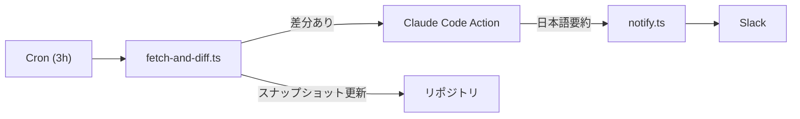

# cc-news-bot

claude code actions で定期的に news を収集。Slack チャンネル等に定期的に送る

## 概要

AI コーディングツールの changelog を手動でチェックし続けるのは手間がかかります。このツールは、複数の OSS プロジェクトの changelog を 3 時間ごとに自動取得し、変更があれば Claude による日本語要約を生成して Slack チャンネルに通知します。

チームの情報キャッチアップコストを削減し、重要な変更を見逃さない仕組みを提供します。

## 監視対象

| ソース             | 取得方式        | リポジトリ                                                          |
| ------------------ | --------------- | ------------------------------------------------------------------- |
| Claude Code        | Raw Markdown    | [anthropics/claude-code](https://github.com/anthropics/claude-code) |
| OpenAI Codex       | GitHub Releases | [openai/codex](https://github.com/openai/codex)                     |
| GitHub Copilot CLI | Raw Markdown    | [github/copilot-cli](https://github.com/github/copilot-cli)         |

## アーキテクチャ



- **fetch-and-diff.ts** — 3 ソースを並行取得し、SHA-256 ハッシュで前回との差分を検出。差分があれば `data/diffs/` に unified diff を書き出す
- **Claude Code Action** — `data/diffs/` を読み取り、日本語要約を `data/summaries/` に書き出す
- **notify.ts** — 要約を Slack のメインメッセージとして投稿し、raw diff をスレッド返信で添付する

## 動作の仕組み

GitHub Actions ワークフロー（`.github/workflows/changelog-notifier.yml`）が以下のステップで実行されます。

1. **Cron**（`0 */3 * * *`）または手動トリガーで起動
2. **fetch-and-diff** — 3 ソースを並行取得 → SHA-256 ハッシュで差分検出 → `data/diffs/` に書き出し
3. **Claude Code Action** — diff ファイルを読み取り → 日本語要約を生成 → `data/summaries/` に書き出し
4. **notify** — 要約を Slack メインメッセージ + raw diff をスレッド返信で投稿
5. **自動コミット** — `data/snapshots/` と `state.json` をリポジトリに保存

初回実行時は通知を行わず、スナップショットの保存（ベースライン確立）のみ実行します。

## Slack 通知の形式

メインメッセージ:

```
*claude-code* の changelog が更新されました

## ひとこと
- 目玉機能のわかりやすいまとめ

## 変更内容
### 新規追加
- xxx

### 修正
- xxx

### 改善
- xxx

## 用語解説
- 特殊な用語の解説
```

スレッド返信として raw diff が添付されます（3500 文字を超える場合は自動分割）。

## セットアップ

### GitHub Secrets

| シークレット名            | 説明                                         |
| ------------------------- | -------------------------------------------- |
| `SLACK_BOT_TOKEN`         | Slack Bot Token（`chat:write` スコープ必須） |
| `CLAUDE_CODE_OAUTH_TOKEN` | Claude Code Action の OAuth トークン         |
| `GITHUB_TOKEN`            | 自動生成（追加設定不要）                     |

### Slack Bot の権限

Slack App に `chat:write` スコープを付与し、通知先チャンネルに Bot を招待してください。

### リポジトリ設定

ワークフローが `data/snapshots/` と `state.json` を自動コミットするため、リポジトリの Actions に `contents: write` 権限が必要です（ワークフロー YAML で設定済み）。

## プロジェクト構成

```
.
├── src/
│   ├── main.ts            # コア処理（run 関数）
│   ├── config/            # ソース定義・ディレクトリ定数
│   ├── services/          # fetch / diff / slack / state サービス
│   ├── scripts/           # エントリポイント（fetch-and-diff, notify）
│   └── __tests__/         # テストファイル
├── data/
│   ├── snapshots/         # 前回の changelog（コミット対象）
│   ├── diffs/             # 検出された差分（一時ファイル）
│   ├── summaries/         # Claude 生成の要約（一時ファイル）
│   └── current/           # 今回取得した changelog（一時ファイル）
├── .github/workflows/    # GitHub Actions ワークフロー
└── .kiro/                 # Spec-Driven Development 設定
```

## ライセンス

MIT
